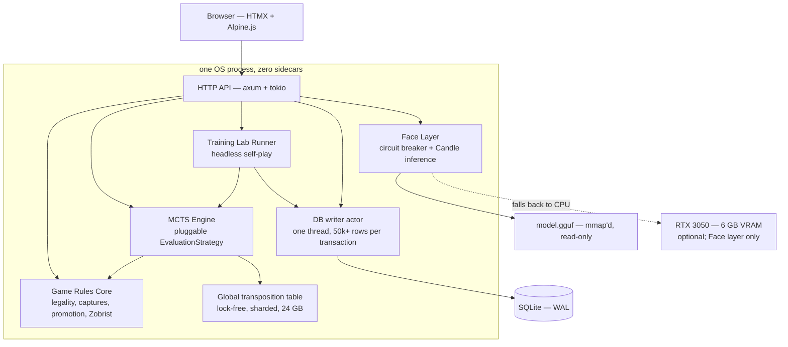

# Draughts

**A single-binary draughts engine and self-play training lab, written in Rust.**

Draughts plays English draughts — the 8x8 game also known as American checkers or straight checkers — using Monte Carlo tree search. It does two things: it plays you, and it plays itself a million times to generate training data. A quantized language model runs inside the same process — on the GPU where there is one — to talk trash while it beats you, and it is never permitted to touch the game.

One executable. One SQLite file. No daemons, no sidecars, no orchestration.

---

## Status

> **Scaffolding stage — it builds, it validates its configuration, and it does not play yet.**
>
> The architecture is designed, reviewed, and approved at version 1.4. The tree now carries the module layout, the configuration types and their startup validation, device selection, the circuit breaker, the schema, and the route surface. Move generation, tree search, the writer actor loop, the lab worker pool, and GGUF loading are `todo!()` at the seams the architecture defines for them. [CHANGELOG.md](CHANGELOG.md) records what exists.
>
> Version 1.4 re-baselined the whole document onto the machine it will actually be built on — 64 GB, 14 Broadwell cores on two memory channels, and an RTX 3050 — and made CUDA the default device for commentary, because on that host the CPU path misses its own deadline. See [§0.4](docs/architecture/00-revision-history.md#04-what-changed-in-14).

If you are here to evaluate the design rather than the code, start with the **[architecture documentation](docs/architecture/README.md)**.

```bash
just setup && cp draughts.example.toml draughts.toml
just check-config    # §23.1 validation against this host
just ci              # the full merge gate — the same recipes CI runs
```

---

## The Two Modes

**Play Mode — human vs. CPU.** A server-rendered HTMX board. You move, the engine searches, the board comes back at engine speed. Commentary arrives separately, whenever the model finishes, because a *successful* 2.5-second inference on the critical path is still 2.5 seconds.

**Training Lab Mode — CPU vs. CPU.** Headless self-play across a worker pool, all workers sharing one transposition table, all writes funnelled through one batching actor. Move histories, terminal results, and sampled MCTS statistics land in SQLite as training data for a future neural evaluator.

---

## Design



Five decisions carry most of the weight:

| Decision | Why |
|---|---|
| **The evaluator is a trait, not a function** | Random rollouts today, a neural value head later, without touching tree search. See [§6.2](docs/architecture/06-mcts-extensibility.md#62-evaluation-strategy-trait). |
| **One global lock-free transposition table** | Self-play revisits positions constantly. Memory is not the scarce resource; recomputation is. See [§6.7](docs/architecture/06-mcts-extensibility.md#67-global-transposition-table--new-in-11). |
| **Every database write goes through one actor** | SQLite permits exactly one writer. Rather than fight that, make that writer maximally efficient and absorb bursts in RAM. See [§11.2](docs/architecture/11-database-architecture.md#112-write-strategy--mpsc-actor-pattern). |
| **The language model runs in-process, behind a circuit breaker** | No daemon, no REST hop, no second failure domain — but a degraded model must never degrade gameplay, so three failures amputate it for five minutes. See [§7.8](docs/architecture/07-face-llm-layer.md#78-circuit-breaker--new-in-11). |
| **CUDA is the default inference device, and required by nothing** | Two DDR4 channels give two CPU cores ~15 GB/s; the card gives ~168. On this host the CPU path cannot meet its own 2.5 s deadline at any model worth listening to — but a missing GPU falls back rather than failing, and the default build has no CUDA dependency at all. See [§7.4.1](docs/architecture/07-face-llm-layer.md#741-device-selection). |
| **The LLM never plays** | It cannot choose, validate, or influence a move. The constraint is enforced by types, not by convention. See [§2.3](docs/architecture/02-scope-and-constraints.md#23-explicit-constraint-llm-does-not-play-draughts). |

The guiding principle: **the engine is authoritative and everything else is optional.** A game played entirely against canned commentary, with no model file present, is a fully valid game.

---

## Documentation

The architecture is one document split across [34 files with an index](docs/architecture/README.md). Suggested entry points:

| If you want to… | Read |
|---|---|
| Understand the system in ~40 minutes | [§1](docs/architecture/01-executive-summary.md), [§3](docs/architecture/03-system-context.md), [§4](docs/architecture/04-separation-of-concerns.md), [§5](docs/architecture/05-runtime-components.md) |
| Work on the engine | [§6](docs/architecture/06-mcts-extensibility.md) |
| Work on persistence | [§11](docs/architecture/11-database-architecture.md), [§12](docs/architecture/12-database-schema.md), [§13](docs/architecture/13-data-dictionary.md) |
| Work on the commentary layer | [§7](docs/architecture/07-face-llm-layer.md) |
| See the HTTP contract | [§9](docs/architecture/09-api-contract.md) |
| Know what "done" means | [§25](docs/architecture/25-acceptance-criteria.md) |
| Work on the GPU path | [§7.4.1](docs/architecture/07-face-llm-layer.md#741-device-selection), [§16.6](docs/architecture/16-memory-strategy.md#166-vram-budget--new-in-14), [§19.6](docs/architecture/19-extensibility-roadmap.md#196-gpu-acceleration) |
| Know what could go wrong | [Appendix D](docs/architecture/appendix-d-risks-and-open-questions.md) |
| Know what is being built next | [Roadmap to MVP](docs/ROADMAP.md) — the milestones and issues that close out §25 |

---

## Planned Stack

| Layer | Choice |
|---|---|
| Language | Rust |
| HTTP | `axum` on Tokio |
| Frontend | HTMX, with Alpine.js only for square selection |
| Persistence | SQLite in WAL mode — no other datastore |
| Concurrency | `crossbeam-channel`, `rayon`, `dashmap` |
| Inference | Hugging Face `candle`, quantized GGUF — Qwen2.5-1.5B-Instruct (Apache 2.0) on CUDA, Qwen2.5-0.5B-Instruct on the CPU fallback. Both Apache 2.0 |
| GPU | CUDA via `candle`, behind a `cuda` cargo feature. Face layer only — the engine never touches the device |

**Target host:** a single machine — 64 GB DDR4 (two of four channels populated), a Xeon E5-2690 v4 at 14 cores / 28 threads, and an NVIDIA RTX 3050 with 6 GB of VRAM. Every memory, latency, and throughput figure in the document is derived from those numbers through a stated relation, so it can be re-derived for a different machine ([§2.4](docs/architecture/02-scope-and-constraints.md#24-hardware-baseline)).

The GPU is used by the commentary layer and by nothing else. **No component requires it:** `cargo build --release` with no features produces a binary with no CUDA dependency that plays the same draughts on a machine with no driver, and a card that is absent, busy, or out of memory falls back to a CPU profile rather than failing ([§20.10](docs/architecture/20-testing-strategy.md#2010-device-parity-and-cuda-tests)). Correctness must hold at two cores. Down-tuned profiles for smaller hosts are documented in [§11.1](docs/architecture/11-database-architecture.md#111-sqlite-runtime-configuration) and [§14.2](docs/architecture/14-sampling-strategy.md#142-recommended-defaults).

---

## Intended Layout

Once implemented, a deployment is four files:

```text
draughts/
├── draughts                                    # the executable
├── draughts.toml                               # configuration (copy draughts.example.toml)
├── data/
│   └── draughts.db                             # SQLite + -wal + -shm
└── models/
    ├── qwen2.5-1.5b-instruct-q4_k_m.gguf       # ~1.0 GB — CUDA profile
    ├── qwen2.5-1.5b-instruct/tokenizer.json
    ├── qwen2.5-0.5b-instruct-q4_k_m.gguf       # ~0.4 GB — CPU fallback profile
    └── qwen2.5-0.5b-instruct/tokenizer.json
```

Both models ship because the resolved device can change between one boot and the next without anyone editing configuration, and a single `model_path` would then put a 4.3-second model against a 2.5-second deadline — a correct degradation that produces a silent outage ([§7.5.4](docs/architecture/07-face-llm-layer.md#754-two-profiles-not-one-model-path)).

```bash
# Portable: no CUDA dependency, runs anywhere.
just build-release

# Target host: adds the CUDA path. Ampere GA10x is compute capability 8.6.
CUDA_COMPUTE_CAP=86 just build-cuda

./target/release/draughts --config draughts.toml
```

Both builds are gated by CI, and the portable one is additionally built and *run* in a container with no driver and no toolkit — because a missing CUDA library shows up at load time, not at link time.

Both are also what a release ships: two Linux x86-64 tarballs, each with a `.sha256` verified in CI before publishing. Releases are cut by merging a version bump whose CHANGELOG section is closed — nobody runs `git tag`, and the release notes are the CHANGELOG section, written by a person. See [CONTRIBUTING.md](CONTRIBUTING.md#releasing).

The `.gguf` is not embedded in the binary — a 6 GB executable would be hostile to every build and CI system it touched. "Single binary" means one process and one deployable unit of *code*.

---

## Targets

Recorded so a build that misses them by an order of magnitude is recognizably wrong, not merely disappointing. Full table in [Appendix B](docs/architecture/appendix-b-performance-targets.md).

| Metric | Target |
|---|---|
| Lab games per minute | 600 – 1 200 (10 workers, 800 iterations) |
| Transposition hit rate, steady state | 0.6 – 0.8 |
| Sustained write throughput | 100k – 250k rows/s |
| Play Mode move latency, p99 | < 1 600 ms |
| Commentary latency, CUDA, 64 tokens, p50 | 0.8 – 1.5 s |
| Peak RSS, full-density batch | < 56 GB — a gate, not a metric |
| Peak VRAM, commentary under lab load | < 4.5 GB — also a gate |

---

## Contributing

See **[CONTRIBUTING.md](CONTRIBUTING.md)** for the setup, the gate, the release procedure, and the conventions. Security findings go through **[SECURITY.md](SECURITY.md)**, privately, not as an issue. A careful read of [docs/architecture/](docs/architecture/README.md) and an issue for anything that does not hold together is still worth as much as a patch — the eight defects listed in [§0.2.2](docs/architecture/00-revision-history.md#022-corrections) were all found that way, and the two revisions since were each caused by a single number nobody had derived.

Five rules are not negotiable, because the whole design rests on them. The first three are enforced mechanically — the first and third by CI greps, the second by a test suite — and the last two are enforced by review:

1. **Reading a persisted BLOB without dispatching on its `format_version` is a review-blocking defect.** See [§13.7](docs/architecture/13-data-dictionary.md#137-format_version--new-in-11).
2. **The transposition table may change how long a search takes and must never change what it returns.** See [§20.5](docs/architecture/20-testing-strategy.md#205-transposition-table-tests).
3. **`candle_core::Device` is constructed in exactly one function.** A second construction anywhere in the tree is what turns the next device change from a one-line edit into a search-and-replace. See [§19.6.5](docs/architecture/19-extensibility-roadmap.md#1965-what-the-mvp-must-preserve).
4. **The LLM never plays.** It cannot choose, validate or influence a move, and the constraint is enforced by types: `CommentaryContext` is the whole of what the Face layer is given, and there is no move in it. Adding a field to that struct is an architectural change, not a convenience. See [§2.3](docs/architecture/02-scope-and-constraints.md#23-explicit-constraint-llm-does-not-play-draughts).
5. **A change that can only be tested on a GPU has broken the CPU path.** The whole suite runs on `face.device = "cpu"`, on the default build, on a runner with no driver. See [§20.10](docs/architecture/20-testing-strategy.md#2010-device-parity-and-cuda-tests).

---

## License

MIT — see [LICENSE](LICENSE). Copyright (c) 2026 garnizeH.
