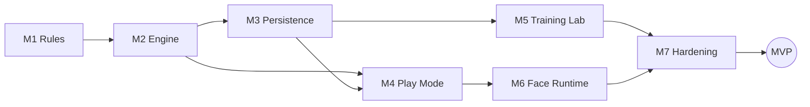

# Roadmap to MVP

| | |
|---|---|
| **Version** | 1.0 |
| **Status** | Living document — amended as the work reveals itself |
| **Last updated** | 2026-09-02 |
| **Tracks** | [architecture v1.4](architecture/README.md), [§25 acceptance criteria](architecture/25-acceptance-criteria.md) |
| **Execution** | GitHub milestones and issues; this file is the plan, GitHub is the state |

This document is the plan of record for getting `draughts` from scaffolding to
the MVP defined in [§25](architecture/25-acceptance-criteria.md). It exists to
be transcribed into GitHub: every milestone below becomes a GitHub milestone,
every issue row becomes a GitHub issue.

It is deliberately thin. The specification already exists in
[docs/architecture/](architecture/README.md) and is approved at v1.4 — an issue's
job is to name the work and point at the § that owns it, not to restate it. When
an issue and the architecture disagree, the architecture is right.

**Scope of the plan:** the 27 acceptance criteria in §25 and nothing else.
Everything in [§19](architecture/19-extensibility-roadmap.md) — neural
evaluators, policy MCTS, rule variants, GPU evaluation inside the search — is
post-MVP and is tracked in the *Post-MVP* section at the end, unmilestoned.

---

## How this document changes

This is a **live document**. The architecture is settled; the plan is not, and
pretending otherwise would only mean discovering the drift in a stale table.
It is versioned so that a plan cited in a PR can be pinned to a revision.

**Versioning.** `MAJOR.MINOR`, recorded in the table above and in the revision
history at the end of this file.

| Change | Bump |
|---|---|
| A milestone added, removed, resequenced, or its exit criteria changed | MAJOR |
| An issue added, removed, split, or moved between milestones | MINOR |
| Wording, a label, a § link, a typo, a status tick | none |

**The rules that keep it honest.**

1. **Issue IDs are permanent and never reused.** An issue that is dropped stays
   in its table, struck through, with a one-line reason. `M3-7` means one thing
   forever, in this file and in every commit message that cites it.
2. **The GitHub issue carries the state; this file carries the plan.** Do not
   mirror open/closed status here — it will be wrong within a day. The one
   exception is a milestone's line in the *Milestone status* table below.
3. **A scope change is a document change first.** If the work turns out to need
   an issue that is not here, add it here in the same PR that adds it to GitHub,
   and bump the minor version.
4. **The architecture wins.** If an issue and its § disagree, the § is right and
   the issue is a defect — unless the § can be shown wrong, which is a change to
   [docs/architecture/](architecture/README.md) and to
   [§0](architecture/00-revision-history.md), not to this file.
5. **Every amendment gets a revision-history row.** One line, what changed and
   why. The history is the point of versioning it at all.

### Milestone status

The only status this file tracks. Update the row when a milestone opens or
closes; leave the issues to GitHub.

| Milestone | Status | Opened | Closed |
|---|---|---|---|
| M1 Rules Core | not started | — | — |
| M2 Search Engine | not started | — | — |
| M3 Persistence | not started | — | — |
| M4 Play Mode | not started | — | — |
| M5 Training Lab | not started | — | — |
| M6 Face Runtime | not started | — | — |
| M7 Hardening & Acceptance | not started | — | — |

---

## Where the tree stands today

Built and tested: the module layout, the `justfile` gate, configuration and
§23.1 startup validation, `--check-config`, device selection, the circuit
breaker, canned commentary, sanitization, the Zobrist key table and its
fingerprint, migration 1, the `/api/v1` route surface, `/health`, and the §9.1
error model.

Also built, and not on this roadmap because it predates nothing and blocks
everything: the release pipeline (`release.yml`, two Linux tarballs, tags cut
from a version bump whose CHANGELOG section is closed), `just pre-pr`, and the
supply-chain and governance work in [CHANGELOG.md](../CHANGELOG.md). Two rows
below are already satisfied by it — see the note under M6 and M7.

Unimplemented, each a `todo!()` at its named seam:

Located by their `todo!()` message rather than by line number, because a line
number in a document is wrong by the next commit — five of the eleven citations
here were already pointing at the wrong line before a single seam had been
touched. `grep -rn 'todo!(' src/` is the authoritative list.

| Seam | File | `todo!()` says | Owning § |
|---|---|---|---|
| Move generation | [moves.rs](../src/rules/moves.rs) | `move generation` | §5.3 |
| Move application | [moves.rs](../src/rules/moves.rs) | `move application` | §5.3 |
| Tree search | [mcts.rs](../src/engine/mcts.rs) | `tree search` | §6.4 |
| Random rollout | [evaluator.rs](../src/engine/evaluator.rs) | `random rollout playout` | §6.3 |
| TT store / capacity | [transposition.rs](../src/engine/transposition.rs) | `store, merge and capacity enforcement` | §6.7.5 |
| Writer actor loop | [writer.rs](../src/db/writer.rs) | `writer actor loop` | §11.2.2 |
| Lab worker pool | [runner.rs](../src/lab/runner.rs) | `worker pool and batch lifecycle` | §5.5, §15.3 |
| Batch recovery | [runner.rs](../src/lab/runner.rs) | `interrupted-batch recovery` | §11.4 |
| GGUF + tokenizer load | [candle_adapter.rs](../src/face/candle_adapter.rs) | `GGUF load and tokenizer initialisation` | §7.4 |
| Host residency accounting | [candle_adapter.rs](../src/face/candle_adapter.rs) | `host-side residency accounting` | §16.4 |
| CUDA memory accounting | [candle_adapter.rs](../src/face/candle_adapter.rs) | `CUDA memory accounting` | §16.6 |

The `/api/v1` handlers return `NotFound` or `Internal` placeholders, and
[tests/load.rs](../tests/load.rs) is seven `todo!()` bodies.

---

## Milestones

Ordered by dependency, not by preference. Each one ends with something
demonstrable; nothing is merged behind a flag waiting for a later milestone.

| # | Milestone | Ends when |
|---|---|---|
| M1 | Rules Core | A legal game can be played out in a test, and perft matches the committed baseline |
| M2 | Search Engine | MCTS picks a move, and the transposition table provably does not change what it returns |
| M3 | Persistence | The writer actor sustains its throughput target and a hard kill loses only bulk data |
| M4 | Play Mode | A human beats — or loses to — the CPU in a browser |
| M5 | Training Lab | A batch of self-play games runs, persists, is monitored, and cancels cleanly |
| M6 | Face Runtime | A real GGUF produces commentary on CPU and on CUDA, and its absence changes nothing |
| M7 | Hardening & Acceptance | All 27 criteria in §25 are demonstrated, measured, and recorded |

### Definition of done — applies to every issue

1. `just pre-pr` green, output reported as run — every job CI runs, not only
   `just ci`, which is one of six. Where a recipe cannot run on the host (the
   CUDA path needs a toolkit), name it rather than rounding it up to green.
2. Tests named as the property they assert (§ CLAUDE.md), asserting what
   [§20](architecture/20-testing-strategy.md) requires for the touched area.
3. Comments cite the § that decided any non-obvious constant.
4. [CHANGELOG.md](../CHANGELOG.md) updated; the seam removed from the
   "Not yet implemented" list when it is the last one in its area.
5. New performance numbers land in
   [Appendix B](architecture/appendix-b-performance-targets.md), not in a comment.
6. No check weakened to make a test pass.

### Labels

`area:rules` `area:engine` `area:db` `area:api` `area:ui` `area:lab`
`area:face` `area:config` `area:ci` ·
`type:seam` `type:test` `type:perf` `type:docs` `type:infra` ·
`gate:determinism` `gate:format-version` `gate:memory` `gate:cpu-only` ·
`prio:mvp-blocker` `prio:mvp` `prio:post-mvp`

The four `gate:` labels mark issues that touch one of the five rules in
CLAUDE.md. They require an `architecture-reviewer` pass before merge.

---

## M1 — Rules Core

**Goal:** English draughts, correct and fast, with nothing above it.
**Unblocks:** everything.

| ID | Issue | § | Labels |
|---|---|---|---|
| M1-1 | Bitboard representation and square indexing invariants | §5.3 | `area:rules` |
| M1-2 | Move generation, including mandatory capture | §5.3 | `area:rules` `type:seam` `prio:mvp-blocker` |
| M1-3 | Multi-jump sequence enumeration | §5.3 | `area:rules` `type:seam` |
| M1-4 | Move application with incremental Zobrist update | §5.3, §20.1 | `area:rules` `type:seam` `gate:format-version` |
| M1-5 | Promotion to king and king movement | §5.3 | `area:rules` |
| M1-6 | Terminal detection: win, loss, no-legal-move | §5.3 | `area:rules` |
| M1-7 | Draw rules: repetition and the non-capture ply counter | §5.3 | `area:rules` |
| M1-8 | Perft baselines to fixed depth, committed as constants | §20.1 | `area:rules` `type:test` |
| M1-9 | Property test: incremental Zobrist equals full recomputation | §20.1 | `area:rules` `type:test` `gate:format-version` |
| M1-10 | Property tests for move generation over a random-play corpus | §20.1 | `area:rules` `type:test` |

**Exit:** §25 criteria 2, 4, 5 provable at the rules layer. `just bench`
produces a move-generation baseline.

---

## M2 — Search Engine

**Goal:** MCTS that returns a legal, sensible move, and a shared transposition
table that is a speed knob and never a correctness one.
**Depends on:** M1.

| ID | Issue | § | Labels |
|---|---|---|---|
| M2-1 | Random rollout evaluator | §6.3 | `area:engine` `type:seam` |
| M2-2 | Tree search: selection, expansion, simulation, backpropagation | §6.4 | `area:engine` `type:seam` `prio:mvp-blocker` |
| M2-3 | Iteration and deadline budgets, Play Mode vs. Lab | §6.4, §16.2 | `area:engine` |
| M2-4 | Parallel search over the rayon pool, with core reservation | §15.3, §15.4 | `area:engine` |
| M2-5 | TT store, merge semantics, and capacity retirement | §6.7.5 | `area:engine` `type:seam` `gate:determinism` |
| M2-6 | `EvaluatorIdentity` scoping of probes | §6.7 | `area:engine` `gate:determinism` |
| M2-7 | `TtMode::Deterministic` purity gating on store and probe | §6.7 | `area:engine` `gate:determinism` |
| M2-8 | Collision handling: verify before serve, count the miss | §20.5 | `area:engine` `type:test` `gate:determinism` |
| M2-9 | **Differential search test at 1, 2, 8 and 10 threads** | §20.5 | `area:engine` `type:test` `gate:determinism` `prio:mvp-blocker` |
| M2-10 | Determinism under a fixed seed; reproducible-batch harness | §20.5 | `area:engine` `type:test` `gate:determinism` |
| M2-11 | Concurrency soak at 20 threads, above the worker count | §20.5 | `area:engine` `type:test` |
| M2-12 | Engine behaviour tests: prefers a win, avoids a loss, value symmetry | §20.2 | `area:engine` `type:test` |
| M2-13 | `is_position_pure()` honesty property test | §20.2 | `area:engine` `type:test` `gate:determinism` |
| M2-14 | Criterion baselines: search speedup, hit rate, probe rate | §20.9, App. B | `area:engine` `type:perf` |

**Exit:** §25 criteria 3, 10, 16, 17. `just test-tt-off` green.

---

## M3 — Persistence

**Goal:** one writer, batched, with durability classes that mean what they say.
**Depends on:** M2 (records carry search output).

| ID | Issue | § | Labels |
|---|---|---|---|
| M3-1 | Writer actor loop: drain, batch, commit, ack | §11.2.2 | `area:db` `type:seam` `prio:mvp-blocker` |
| M3-2 | Durability classes: durable acks after commit, bulk may be lost | §11.4, §20.6 | `area:db` `gate:format-version` |
| M3-3 | Backpressure: lab blocks, durable returns `write_queue_saturated`, telemetry drops | §11.2.5 | `area:db` `area:api` |
| M3-4 | Retry classification: `SQLITE_BUSY` retried, constraint violations not | §20.6 | `area:db` |
| M3-5 | Poisoned-batch isolation: mark `failed`, keep draining | §20.6 | `area:db` |
| M3-6 | Degraded mode on a full disk: 503 durable, `/health` degraded, reads served | §17.3, §20.6 | `area:db` `area:api` |
| M3-7 | Id leasing: disjoint ranges, `resume_from` never reissues | §5.6, §20.6 | `area:db` |
| M3-8 | Message ordering: `Positions` never commits before its `Game` | §20.6 | `area:db` |
| M3-9 | Encode/decode every BLOB record dispatching on `format_version` | §13.7 | `area:db` `gate:format-version` `prio:mvp-blocker` |
| M3-10 | Static check: every INSERT names `format_version` from `CURRENT_FORMAT_VERSION` | §20.8 | `area:db` `area:ci` `gate:format-version` |
| M3-11 | Unknown version yields `unsupported_format_version`, never a panic | §20.8 | `area:db` `type:test` `gate:format-version` |
| M3-12 | Committed historical BLOB fixtures, decoded by the current build | §20.8 | `area:db` `type:test` `gate:format-version` |
| M3-13 | WAL: manual checkpointing under `journal_size_limit` over a long run | §11, §20.4 | `area:db` |
| M3-14 | Writer telemetry on `/health`: queue depth, high-water, rows, last commit | §9.2, §21 | `area:db` `area:api` |
| M3-15 | Round-trip and batch-integrity tests, 250k rows, mixed types | §20.6 | `area:db` `type:test` |
| M3-16 | Flush-barrier test: kill immediately after ack, row survives | §20.6 | `area:db` `type:test` |

**Exit:** §25 criteria 6, 13, 18, 19, 22.

---

## M4 — Play Mode

**Goal:** a human plays the CPU in a browser, and the commentary pane is not on
the critical path.
**Depends on:** M2, M3.

| ID | Issue | § | Labels |
|---|---|---|---|
| M4-1 | Match registry: in-memory state, lifecycle, persistence on terminal | §5.2, §8 | `area:api` `prio:mvp-blocker` |
| M4-2 | `POST /matches` — start a human vs. CPU match | §9.3 | `area:api` |
| M4-3 | `GET /matches/{id}` — state, legal moves, history | §9 | `area:api` |
| M4-4 | `POST /matches/{id}/moves` — validate, apply, search, respond | §9 | `area:api` `prio:mvp-blocker` |
| M4-5 | Illegal move rejected as `illegal_move` / 409; finished match as `match_finished` | §9.1 | `area:api` `type:test` |
| M4-6 | `POST /matches/{id}/resign` | §9 | `area:api` |
| M4-7 | Engine work off the Tokio workers via `spawn_blocking` | §5.2, §15 | `area:api` `area:engine` |
| M4-8 | Per-match commentary slot: generated in the background, served immediately | §10.3 | `area:api` `area:face` |
| M4-9 | `GET /ui/matches/{id}/commentary` — HTMX partial, polled | §10.3 | `area:api` `area:ui` |
| M4-10 | Server-rendered board partial and legal-target highlighting | §10.2 | `area:ui` |
| M4-11 | Pages: `/`, `/play/{id}`, `/settings` | §10.1 | `area:ui` |
| M4-12 | Integration tests: start, legal move, illegal move, finish, rows persisted | §20.3 | `area:api` `type:test` |
| M4-13 | Play Mode move-latency baseline, p50/p99, iterations per move | §20.9, App. B | `area:api` `type:perf` |

**Exit:** §25 criteria 1, 2, 3, 4, 5, 6, 14.

---

## M5 — Training Lab

**Goal:** self-play at density, monitored, cancellable, and recoverable.
**Depends on:** M3, M2.

| ID | Issue | § | Labels |
|---|---|---|---|
| M5-1 | Worker pool and batch lifecycle | §5.5, §15.3 | `area:lab` `type:seam` `prio:mvp-blocker` |
| M5-2 | Sampling: the three profiles and their knobs | §14 | `area:lab` |
| M5-3 | Persist games, move histories, positions and edges | §12, §14 | `area:lab` `area:db` `gate:format-version` |
| M5-4 | `POST /lab/batches` and `GET /lab/batches` | §9 | `area:api` `area:lab` |
| M5-5 | `GET /lab/batches/{id}` — progress, queue depth, TT hit rate | §9, §21 | `area:api` `area:lab` |
| M5-6 | Two-phase cancel: `running → cancelling → cancelled`, drained | §17.6, §20.3 | `area:lab` |
| M5-7 | Interrupted-batch recovery on startup, `completed_games` recomputed | §11.4 | `area:lab` `type:seam` |
| M5-8 | `GET /lab/batches/{id}/export` — JSONL, every line tagged with `format_version` | §9, §20.8 | `area:api` `gate:format-version` |
| M5-9 | Reproducible batches: `reproducible: true` byte-identical across thread counts | §20.5 | `area:lab` `gate:determinism` |
| M5-10 | Lab pages: `/lab`, `/lab/{id}` | §10.1 | `area:ui` |
| M5-11 | Integration tests: cancel, restart recovery, row verification | §20.3 | `area:lab` `type:test` |
| M5-12 | Play Mode stays responsive under a 10-worker batch | §15.4, §20.3 | `area:lab` `type:test` `prio:mvp-blocker` |
| M5-13 | Lab throughput baseline at 8 / 10 / 14 / 20 workers | §20.9, App. B | `area:lab` `type:perf` |

**Exit:** §25 criteria 7, 8, 9, 17.

---

## M6 — Face Runtime

**Goal:** a real model, on whichever device is actually there, that no other
component can be broken by.
**Depends on:** M4 (there is something to comment on).

| ID | Issue | § | Labels |
|---|---|---|---|
| M6-1 | GGUF load and tokenizer initialisation | §7.4 | `area:face` `type:seam` |
| M6-2 | Generation loop, token budget, and `deadline_ms` enforcement | §7.4, §7.5 | `area:face` |
| M6-3 | Host residency accounting | §16.4 | `area:face` `gate:memory` |
| M6-4 | CUDA memory accounting against `vram_budget_mb` | §16.6 | `area:face` `gate:memory` |
| M6-5 | Profile selection follows the resolved device, never the requested one | §7.4.1 | `area:face` `gate:cpu-only` `prio:mvp-blocker` |
| M6-6 | CUDA requested but unavailable: one warning, CPU profile, visible on `/health` | §7.4.1, §20.10 | `area:face` `gate:cpu-only` `prio:mvp-blocker` |
| M6-7 | CUDA OOM at load: breaker open, `model_loaded: false`, game still playable | §20.10 | `area:face` `gate:cpu-only` |
| M6-8 | CUDA OOM mid-generation surfaces as `FaceError::Inference` | §20.10 | `area:face` |
| M6-9 | Golden-file prompt-safety test: no move, no square, no legal-move list | §20.7 | `area:face` `type:test` `prio:mvp-blocker` |
| M6-10 | Gameplay isolation: a hanging adapter never delays a move | §20.7 | `area:face` `type:test` `prio:mvp-blocker` |
| M6-11 | Full game with both `model_path`s missing: canned lines throughout | §20.3 | `area:face` `type:test` `gate:cpu-only` |
| M6-12 | `--features cuda` compile-only CI job, no device required | §20.10 | `area:ci` `gate:cpu-only` |
| M6-13 | Device-parity and VRAM-budget suite, target host only, not a merge gate | §20.10 | `area:face` `type:test` `prio:mvp` |
| M6-14 | Commentary latency baselines, CPU and CUDA | §20.9, App. B | `area:face` `type:perf` |

**Already satisfied by the scaffold.** M6-12 is done: `ci.yml`'s `cuda-compile`
job runs `just check-cuda` and `just build-cuda` on every PR, compile-only, with
no device. Close it, or rescope it to whatever the milestone still needs — an
issue that describes finished work is worse than no issue, because someone will
pick it up and spend an afternoon finding that out.

**Exit:** §25 criteria 11, 12, 20, 21, 23, 24, 25, 27.

---

## M7 — Hardening & Acceptance

**Goal:** prove the numbers rather than assert them, then call it MVP.
**Depends on:** M5, M6.

| ID | Issue | § | Labels |
|---|---|---|---|
| M7-1 | Fill in [tests/load.rs](../tests/load.rs): 1M games, 5M+ sampled rows | §20.4 | `type:test` `area:db` |
| M7-2 | Commit throughput at `db_batch_rows` of 1 / 1 000 / 50 000 | §20.4 | `type:test` `type:perf` |
| M7-3 | No writer starvation, no reader starvation under sustained commits | §20.4 | `type:test` |
| M7-4 | Queue high-water behaviour drives all three producer policies | §11.2.5, §20.4 | `type:test` |
| M7-5 | **Peak RSS gate under a full-density batch** — a build failure, not a metric | §16.1, §20.4 | `gate:memory` `prio:mvp-blocker` |
| M7-6 | **Peak VRAM gate with commentary under lab load** | §16.6 | `gate:memory` |
| M7-7 | Hard-kill crash test: clean open, only bulk data lost | §20.6 | `type:test` `area:db` |
| M7-8 | Structured logging, metrics and the §21 counters | §21 | `type:infra` |
| M7-9 | Startup and shutdown sequences match §22.3 / §22.4 | §22 | `type:infra` |
| M7-10 | Portable-build container test: no driver, no toolkit, plays a full game | §20.10, §22.1 | `area:ci` `gate:cpu-only` `prio:mvp-blocker` |
| M7-11 | Nightly workflow: `test-tt-off`, `test-load`, `bench`, `check-cuda` | §20 | `area:ci` `type:infra` ¹ |
| M7-12 | Appendix B filled with measured numbers, replacing the estimates | App. B | `type:docs` `type:perf` |
| M7-13 | Operational playbook and README pass for a first-time operator | §22.5 | `type:docs` |
| M7-14 | **Acceptance walkthrough: all 27 §25 criteria demonstrated and recorded** | §25 | `prio:mvp-blocker` `type:docs` |

¹ **Mostly satisfied by the scaffold.** `nightly.yml` already runs `test-tt-off`,
`bench` and `check-cuda`. Only the `test-load` job is missing, and it is
commented out rather than absent — deliberately, because every body in
`tests/load.rs` is `todo!()` and a scheduled run would fail every night rather
than report a load-test result. Rescope M7-11 to "uncomment the `load` job",
which is a one-line change gated on M7-1, or fold it into M7-1.

Likewise M7-10 is half done: `ci.yml`'s `portable-build` job already builds the
default binary in a container with no driver and no toolkit, runs it, and
asserts its linkage. What it cannot do yet is *play a full game*, which is the
half that waits on M1 and M4.

**Exit:** MVP.

---

## Acceptance criteria coverage

Every criterion in [§25](architecture/25-acceptance-criteria.md) maps to at
least one milestone. M7-14 is the issue that verifies the whole table.

| §25 | Criterion (abridged) | Milestone |
|---:|---|---|
| 1 | Start a match against the CPU | M4 |
| 2 | Submit legal moves through the UI | M1, M4 |
| 3 | CPU responds with legal MCTS moves | M2, M4 |
| 4 | Illegal moves rejected cleanly | M1, M4 |
| 5 | Terminal states detected | M1 |
| 6 | Results persisted | M3, M4 |
| 7 | Lab batches startable via API | M5 |
| 8 | Batches persist games, moves, sampled evaluations | M5 |
| 9 | Batches monitored and cancelled | M5 |
| 10 | Evaluator swappable without touching search | M2 |
| 11 | LLM disableable without affecting gameplay | M6 |
| 12 | LLM failure never blocks a move | M6 |
| 13 | WAL enabled | M3 |
| 14 | Frontend minimal and server-driven | M4 |
| 15 | Within the configured memory budget, verified under load | M7 |
| 16 | TT `Deterministic` identical to TT off, every thread count | M2 |
| 17 | `reproducible: true` byte-identical across thread counts | M2, M5 |
| 18 | Writer sustains throughput at 50k rows; high-water observable | M3, M7 |
| 19 | Hard kill loses only bulk-class data | M3, M7 |
| 20 | No external service; plays with the model file absent | M6 |
| 21 | Three failures route to canned within one request | M6 |
| 22 | Every BLOB row carries `format_version`; unknown refused | M3 |
| 23 | Default `--release` build has no CUDA dependency | M6, M7 |
| 24 | Absent/busy/OOM GPU degrades to CPU, one warning, on `/health` | M6 |
| 25 | Startup refuses an infeasible `deadline_ms`, naming the key | done (§23.1) — reverified M7-14 |
| 26 | Within both host and VRAM budgets under full density | M7 |
| 27 | `Device` constructed in exactly one function | done (CI grep) — reverified M7-14 |

---

## Post-MVP

Not milestoned, not scheduled. Recorded so that an issue filed against one of
these is visibly out of the MVP path rather than quietly in it.

- Neural evaluator integration and policy-based MCTS —
  [§19.1](architecture/19-extensibility-roadmap.md), §19.2.
- Offline value-network training on the GPU — §19.6.3.
- Neural evaluation inside MCTS — §19.6.4, explicitly the expensive one.
- Knowledge discovery over the lab database — §19.3.
- Rule variants beyond `english_draughts` — §19.4.
- Server-sent events replacing commentary polling — §10.3.
- Optional process separation — §22.2.
- Human vs. human, accounts, ranking — out of scope by §2.2.

---

## Revision history

| Version | Date | Change |
|---|---|---|
| 1.0 | 2026-09-02 | Initial plan. Seven milestones, 94 issues, mapped against the 27 acceptance criteria in §25 of architecture v1.4. |
