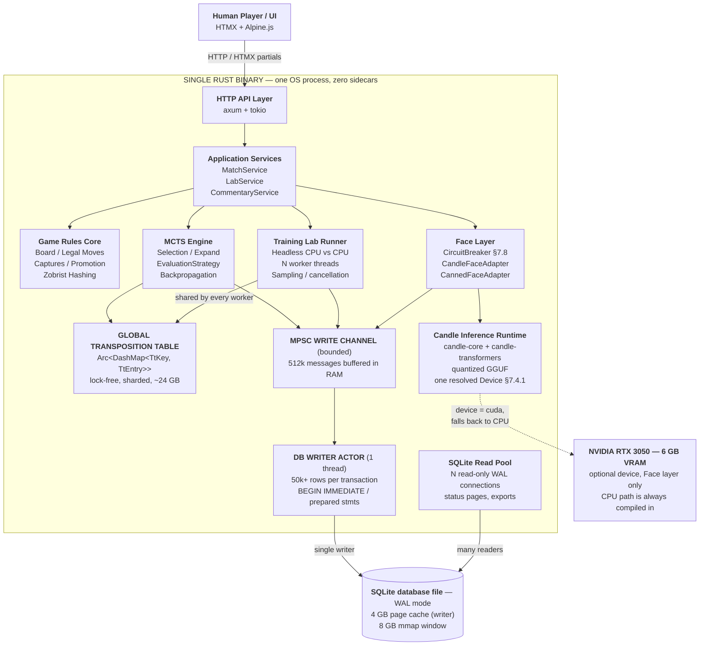

# 3. High-Level System Context

Everything inside the `SINGLE RUST BINARY` subgraph is one operating-system process produced by one `cargo build --release`.



```text
  On-disk artifacts loaded at startup, not services:
     ./draughts                 the binary
     ./data/draughts.db         SQLite + -wal + -shm
     ./models/model.gguf        quantized weights, mmap'd into the process
                                (copied to VRAM when device = cuda)
```

The GPU box is drawn outside the process for a reason: it is a **device the process may use**, not a component the process contains. Nothing in the diagram other than the Candle runtime has an edge to it, and the dashed edge is the only one in the drawing that may be absent at runtime without anything else changing.

Compare with v1.0: the `Local Ollama Server` box is gone. There is no longer any process boundary, port, retry policy, health probe, or version-skew risk between the application and the language model. The failure modes that boundary used to produce are replaced by a single in-process failure mode, handled by the circuit breaker in [§7.8](07-face-llm-layer.md#78-circuit-breaker--new-in-11).

---

← [2. Scope and Constraints](02-scope-and-constraints.md) · **[Index](README.md)** · [4. Separation of Concerns](04-separation-of-concerns.md) →
