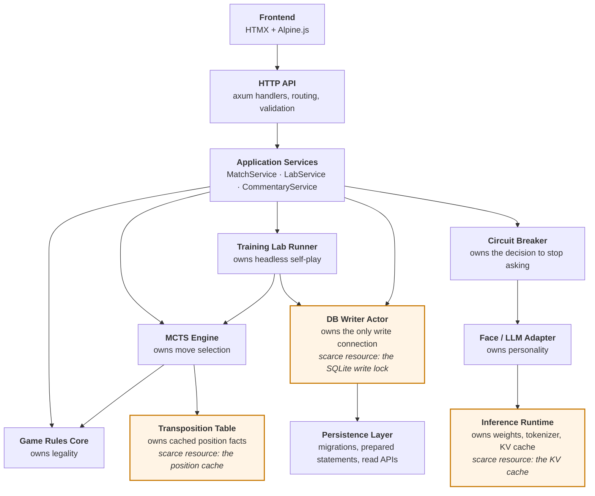

# 4. Separation of Concerns

Calls run downward only. No layer below reaches back up, and the three components introduced in 1.1 — shaded below — each own exactly one scarce resource and expose it through a handle that cannot be misused.

| Layer | Responsibility | Forbidden Responsibilities |
|---|---|---|
| Frontend | Render board, capture clicks, submit moves, display commentary | Move validation, game rules, engine state ownership |
| HTTP API | Request validation, routing, session/match orchestration | Direct MCTS internals, direct model prompting without adapter |
| Application Services | Coordinate game lifecycle, lab batches, commentary triggers | Move generation, direct SQL scattered across handlers |
| Game Rules Core | Board representation, legal moves, captures, promotions, terminal state, Zobrist hashing | UI rendering, persistence, LLM prompting |
| MCTS Engine | Search, move selection, evaluation strategy orchestration, transposition probe/store | Database writes, LLM prompting, HTTP concerns |
| **Transposition Table** | **Concurrent cache of position-keyed search facts; capacity enforcement; hit/miss accounting** | **Rules logic, evaluator policy, any I/O, any allocation on the read path** |
| Training Lab Runner | Headless self-play loops, sampling, submission of write messages | Interactive gameplay, LLM move generation, direct SQL |
| **DB Writer Actor** | **Sole owner of the write connection; drains the MPSC channel; batches, commits, checkpoints, retries** | **Game rules, MCTS logic, business decisions about what to record** |
| Persistence Layer | Schema migrations, prepared statements, id allocation, read APIs | Game rules, MCTS logic |
| Face / LLM Adapter | Generate commentary from safe context | Move calculation, state mutation, direct DB access |
| **Circuit Breaker** | **Track consecutive Face failures, trip open, cool down, probe** | **Interpreting commentary content; any game-state awareness** |
| **Inference Runtime** | **Own the loaded `.gguf`, tokenizer, and KV cache; serialize inference requests; enforce token and wall-clock budgets** | **Prompt construction, game semantics, retry policy** |

The three new rows are the substance of 1.1. Each is a component that owns exactly one scarce resource — the position cache, the single SQLite write lock, and the model's KV cache — and each exposes that resource through a handle that cannot be misused by callers.

---

← [3. High-Level System Context](03-system-context.md) · **[Index](README.md)** · [5. Runtime Components](05-runtime-components.md) →
