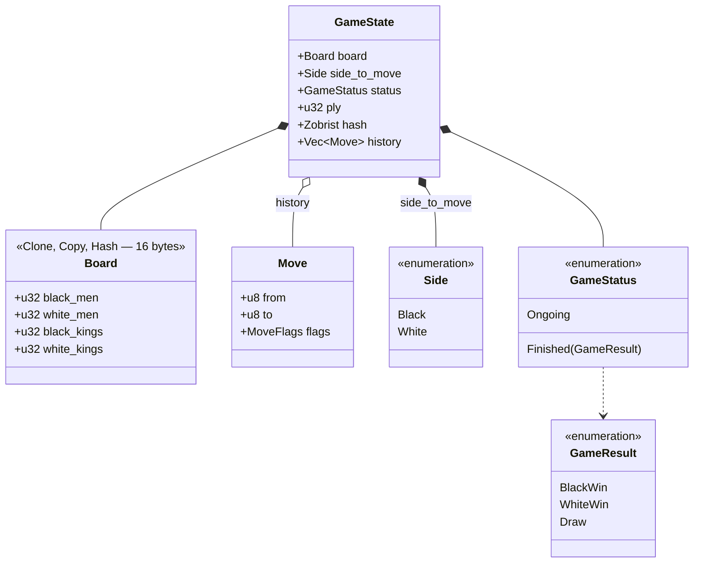
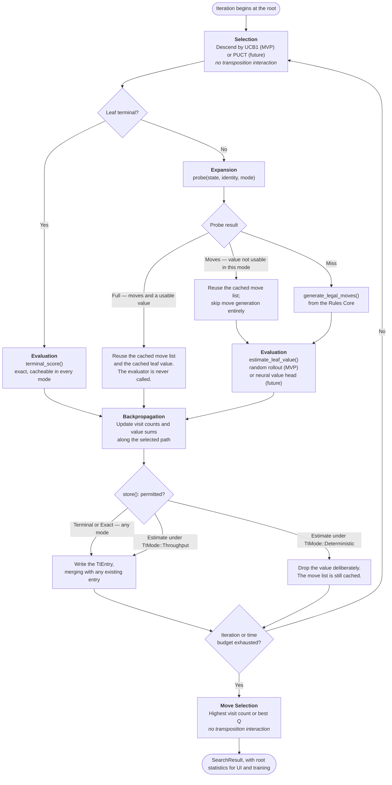
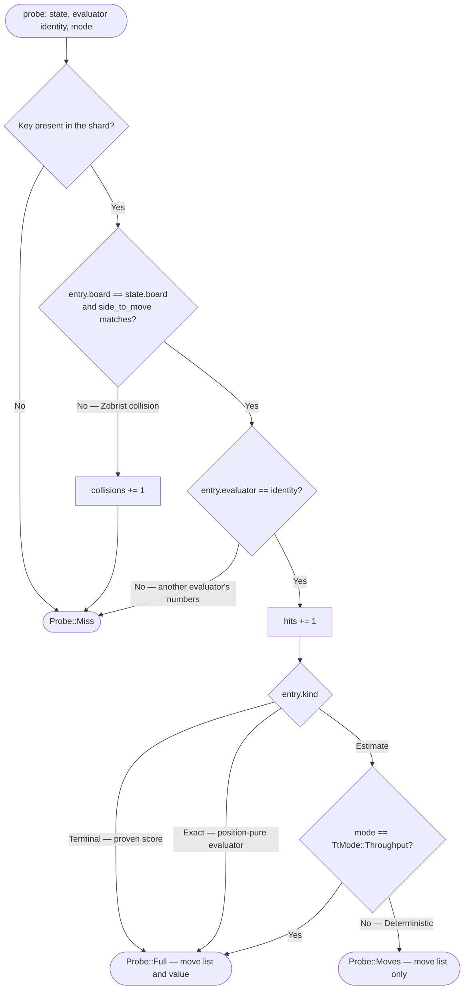

# 6. Rust MCTS Extensibility Design

The central architectural requirement is that MCTS evaluation must be pluggable.

The MVP uses random rollouts, but the design must allow replacement with:

- Heuristic evaluators.
- Neural network value heads.
- Neural network policy/value hybrids.
- Tablebase-like endgame evaluators.
- Learned value models.

without changing the core tree search.

1.1 adds a second requirement of equal weight: **the search must be able to reuse work across games without any evaluator knowing that it is being cached.** The transposition table sits between the engine and the evaluator, and no `EvaluationStrategy` implementation is aware of it.

---

## 6.1 Core Domain Types



```rust
#[derive(Clone, Copy, PartialEq, Eq, Debug)]
pub enum Side {
    Black,
    White,
}

#[derive(Clone, Copy, PartialEq, Eq, Debug)]
pub enum GameResult {
    BlackWin,
    WhiteWin,
    Draw,
}

#[derive(Clone, Copy, PartialEq, Eq, Debug)]
pub enum GameStatus {
    Ongoing,
    Finished(GameResult),
}

#[derive(Clone, Copy, PartialEq, Eq, Debug)]
pub struct Move {
    pub from: u8,
    pub to: u8,
    pub flags: MoveFlags,
}

#[derive(Clone, Copy, PartialEq, Eq, Hash, Debug)]
pub struct Board {
    pub black_men: u32,
    pub white_men: u32,
    pub black_kings: u32,
    pub white_kings: u32,
}

#[derive(Clone, PartialEq, Eq, Debug)]
pub struct GameState {
    pub board: Board,
    pub side_to_move: Side,
    pub status: GameStatus,
    pub ply: u32,
    pub hash: Zobrist,      // incrementally maintained, see §5.3
    pub history: Vec<Move>,
}
```

`Board` gains `Copy + Hash` in 1.1 because it is now stored inline in transposition entries for hit verification. It is 16 bytes; copying it is cheaper than the pointer chase that would replace it.

The exact internal representation may evolve, but the public separation between rules, state, and evaluator must remain stable.

---

## 6.2 Evaluation Strategy Trait

The MVP defines a strategy trait for the evaluation phase.

```rust
pub trait EvaluationStrategy: Send {
    /// Name of evaluator, e.g. "random_rollout" or "nn_value_v1".
    fn name(&self) -> &'static str;

    /// Identity of this evaluator *including its configuration*.
    ///
    /// Transposition entries are only shared between evaluators with an
    /// identical identity. Changing a rollout depth, a network checkpoint,
    /// or a value normalisation must change this value.
    fn identity(&self) -> EvaluatorIdentity;

    /// True when `estimate_leaf_value` is a pure function of `state`.
    ///
    /// Random rollout returns false: its result depends on RNG draws.
    /// A neural value head returns true.
    ///
    /// The engine uses this to decide whether an estimate may be cached
    /// in deterministic mode. See §6.7.4.
    fn is_position_pure(&self) -> bool;

    /// Exact terminal score from the perspective of `perspective`.
    ///
    /// Return range should be normalized to [-1.0, 1.0].
    ///  1.0 = win for perspective
    ///  0.0 = draw
    /// -1.0 = loss for perspective
    fn terminal_score(
        &self,
        state: &GameState,
        perspective: Side,
    ) -> Option<f32>;

    /// Evaluate a non-terminal leaf state from the perspective of `perspective`.
    ///
    /// For random rollout, this plays the game to termination.
    /// For a neural evaluator, this returns a value-head estimate.
    fn estimate_leaf_value(
        &mut self,
        state: &GameState,
        perspective: Side,
    ) -> f32;

    /// Optional prior probabilities for legal moves.
    ///
    /// For MCTS using UCB1/random rollout, this can return uniform priors.
    /// For future neural evaluators, this can return policy-head probabilities.
    fn move_priors(
        &mut self,
        state: &GameState,
        legal_moves: &[Move],
    ) -> Vec<f32> {
        vec![1.0 / legal_moves.len() as f32; legal_moves.len()]
    }
}
```

`identity()` and `is_position_pure()` are the two additions in 1.1. Both exist to make the shared cache safe by construction: the first prevents entries produced by one evaluator from being served to another, the second tells the engine which values are legitimately reusable when reproducibility is required.

This trait remains the primary extension point.

---

## 6.3 Random Rollout Evaluator

The MVP default evaluator.

```rust
pub struct RandomRolloutEvaluator {
    rng_seed: u64,
    max_playout_ply: u32,
    /// The non-progress half of §5.3.1, from `[rules.draw]`. The repetition
    /// half is not here: it needs a key history, which a playout does not carry.
    draw_policy: DrawPolicy,
}

impl EvaluationStrategy for RandomRolloutEvaluator {
    fn name(&self) -> &'static str {
        "random_rollout"
    }

    fn identity(&self) -> EvaluatorIdentity {
        // The threshold and the reset rule change which trajectories the
        // playout can produce, so they change the distribution being sampled.
        // Two configurations that differ here are two evaluators, and §6.7
        // must not pool their estimates. Same reasoning as max_playout_ply.
        EvaluatorIdentity::new("random_rollout", &[
            ("max_playout_ply", self.max_playout_ply as u64),
            ("non_progress_plies", self.draw_policy.non_progress_plies as u64),
            ("non_progress_reset", self.draw_policy.non_progress_reset as u64),
        ])
    }

    fn is_position_pure(&self) -> bool {
        // A rollout samples a trajectory; two calls on the same state
        // legitimately disagree. Never cacheable in deterministic mode.
        false
    }

    fn terminal_score(
        &self,
        state: &GameState,
        perspective: Side,
    ) -> Option<f32> {
        match state.status {
            GameStatus::Finished(result) => {
                Some(score_result(result, perspective))
            }
            GameStatus::Ongoing => None,
        }
    }

    fn estimate_leaf_value(
        &mut self,
        state: &GameState,
        perspective: Side,
    ) -> f32 {
        let mut simulated = state.clone();

        // Three stopping conditions, and only the first two are real. §5.3.1
        // proves that the non-progress rule alone terminates every playout in a
        // finite number of plies, which is what demotes max_playout_ply from
        // the thing that guarantees termination to a backstop against a bug.
        while simulated.status == GameStatus::Ongoing
            && !self.draw_policy.non_progress_draw(&simulated)
            && simulated.ply < self.max_playout_ply
        {
            let legal_moves = generate_legal_moves(&simulated);

            if legal_moves.is_empty() {
                break;
            }

            let selected = random_choice(&legal_moves, &mut self.rng());
            apply_move(&mut simulated, selected);
        }

        match simulated.status {
            GameStatus::Finished(result) => score_result(result, perspective),
            // Two ways to arrive here, scored the same and meaning different
            // things: a playout drawn on the non-progress rule, which is a
            // result, and one cut off at max_playout_ply, which is the
            // backstop declining to guess. §5.3.1.
            GameStatus::Ongoing => 0.0,
        }
    }
}
```

The MCTS engine does not know that this evaluator uses random rollouts. It only knows that it receives a normalized value, and — via `is_position_pure()` — whether that value may be written into a cache that other games will read.

The playout adjudicates its own non-progress draw rather than deferring to the game loop the way a real game does ([§5.3.1](05-runtime-components.md#531-draw-rules-for-mvp--new-in-15)). That is safe in both table modes for the same reason the rollout is impure to begin with: its values are `TtKind::Estimate`, which `Deterministic` mode never caches at all and `Throughput` mode only pools across evaluators of identical identity — and the policy is now part of that identity.

---

## 6.4 Future Neural Evaluator Example

A future neural evaluator can implement the same trait. In 1.1 this is materially closer than it was in 1.0, because Candle is already a dependency and already linked into the binary for the Face layer ([§7.4](07-face-llm-layer.md#74-candle-inference-runtime--replaces-the-ollama-rest-adapter)). The value head and the commentary model share a runtime, not a codebase.

```rust
pub struct NeuralEvaluator {
    model: Box<dyn NeuralModel>,
    checkpoint_id: String,
}

impl EvaluationStrategy for NeuralEvaluator {
    fn name(&self) -> &'static str {
        "nn_value_v1"
    }

    fn identity(&self) -> EvaluatorIdentity {
        EvaluatorIdentity::from_str("nn_value_v1", &self.checkpoint_id)
    }

    fn is_position_pure(&self) -> bool {
        // Deterministic forward pass over a frozen checkpoint.
        true
    }

    fn terminal_score(
        &self,
        state: &GameState,
        perspective: Side,
    ) -> Option<f32> {
        match state.status {
            GameStatus::Finished(result) => {
                Some(score_result(result, perspective))
            }
            GameStatus::Ongoing => None,
        }
    }

    fn estimate_leaf_value(
        &mut self,
        state: &GameState,
        perspective: Side,
    ) -> f32 {
        let features = encode_state_for_network(state);
        let inference = self.model.infer(&features);

        normalize_value_for_perspective(inference.value, state.side_to_move, perspective)
    }

    fn move_priors(
        &mut self,
        state: &GameState,
        legal_moves: &[Move],
    ) -> Vec<f32> {
        let features = encode_state_for_network(state);
        let inference = self.model.infer(&features);

        project_policy_to_legal_moves(&inference.policy, legal_moves)
    }
}
```

No core MCTS refactoring is required, and because `is_position_pure()` returns `true`, a neural evaluator gets the full benefit of the shared table even in deterministic mode — which is precisely where a 24 GB cache pays for itself, since a network forward pass is orders of magnitude more expensive than a rollout.

---

## 6.5 MCTS Engine Structure

```rust
pub struct MctsConfig {
    pub max_iterations: u32,
    pub max_time_ms: u64,
    pub exploration_constant: f32,
    pub cpuct: f32,
    pub seed: u64,
    pub thread_budget: ThreadBudget,
    pub tt_mode: TtMode,
}

pub struct MctsEngine<E: EvaluationStrategy> {
    evaluator: E,
    config: MctsConfig,
    tt: Arc<TranspositionTable>,
}

pub struct SearchResult {
    pub best_move: Move,
    pub root_visits: u32,
    pub root_q: f32,
    pub child_stats: Vec<ChildStats>,
    pub tt_hits: u32,
    pub tt_misses: u32,
}

pub struct ChildStats {
    pub mv: Move,
    pub visits: u32,
    pub wins: u32,
    pub draws: u32,
    pub losses: u32,
    pub q_value: f32,
    pub prior: f32,
}

impl<E: EvaluationStrategy> MctsEngine<E> {
    pub fn new(evaluator: E, config: MctsConfig, tt: Arc<TranspositionTable>) -> Self {
        Self { evaluator, config, tt }
    }

    pub fn search(
        &mut self,
        root_state: &GameState,
    ) -> SearchResult {
        // 1. Initialize root.
        // 2. Repeat until iteration/time budget exhausted:
        //    a. Select child using UCB/PUCT.
        //    b. Expand if non-terminal.
        //       - Probe the transposition table for cached legal moves
        //         and, when permitted, a cached leaf value.
        //    c. On a miss, evaluate the leaf using EvaluationStrategy.
        //    d. Backpropagate value.
        //    e. Store the result subject to TtMode and evaluator purity.
        // 3. Select move by visits or Q/N combination.
        // 4. Return root statistics for UI/training.

        todo!()
    }
}
```

---

## 6.6 MCTS Phase Responsibilities

One MCTS iteration, with each phase's transposition interaction shown inline:



| Phase | MVP Behavior | Transposition Interaction | Future Behavior |
|---|---|---|---|
| Selection | UCB1 with visit counts and configurable exploration | None | PUCT with neural policy priors |
| Expansion | Generate legal moves from rules core | **Probe for cached legal-move list; on hit, skip move generation entirely** | Same, possibly filtered by policy |
| Evaluation | Random rollout to terminal state or playout limit | **Probe for exact terminal score always; probe for estimate only in throughput mode** | Neural value head; probe always valid |
| Backpropagation | Update visit counts and value sums | **Store exact scores always; store aggregated estimates in throughput mode** | Same, possibly with value scaling |
| Move Selection | Highest visit count or best Q | None | Same or temperature-based sampling |

The move-generation cache is the unglamorous half of the transposition table and, for the random-rollout MVP, the larger win: legal-move generation with mandatory-capture resolution and multi-jump enumeration is the hot loop of a draughts engine, and it is a pure function of the position. It is cacheable in every mode, including strict deterministic replay.

---

## 6.7 Global Transposition Table — New in 1.1

### 6.7.1 Rationale

Self-play generates enormous position overlap. Openings converge, endgames collapse into a small number of material configurations, and transpositions are pervasive in draughts because move order frequently commutes. In v1.0, every one of those repeats paid full price: regenerate the legal moves, re-detect terminality, re-run the rollout. Caching that work is the single highest-leverage use of this host's memory, and it is why the table gets 24 of the 64 GB ([§16.1](16-memory-strategy.md#161-memory-budget)).

The table is **global** — one instance shared by every MCTS worker thread in the process — and **lock-free** in the sense that matters operationally: `DashMap` shards the map and takes a per-shard `RwLock`, so with 512 shards and 10 workers, contention on any individual shard is negligible and readers never block each other. There is no global mutex anywhere on the probe path.

On this host the probe path's real cost is not lock contention, it is **memory latency**. A 24 GB hash table has no locality worth the name: every probe is a likely TLB miss and a likely DRAM round trip, on a socket with two populated memory channels ([§2.4](02-scope-and-constraints.md#24-hardware-baseline)). That does not change the design — a DRAM round trip is still enormously cheaper than re-running a rollout — but it does change the tuning advice, which is in [§16.3](16-memory-strategy.md#163-transposition-table-sizing).

### 6.7.2 Structure

```rust
use dashmap::DashMap;
use std::sync::atomic::{AtomicU64, AtomicUsize, Ordering};
use std::sync::Arc;

pub type Zobrist = u64;

/// Key for a cached position.
///
/// The Zobrist hash already folds in side-to-move; the epoch tag scopes
/// entries to a table generation so bulk retirement is O(1) per shard.
#[derive(Clone, Copy, PartialEq, Eq, Hash)]
pub struct TtKey(pub Zobrist);

#[derive(Clone, Copy, PartialEq, Eq, Debug)]
pub enum TtKind {
    /// Proven terminal score. Never expires, never averaged.
    Terminal,
    /// Position-pure evaluator output. Safe in every mode.
    Exact,
    /// Aggregated sample mean from impure evaluators (rollouts).
    /// Only readable in TtMode::Throughput.
    Estimate,
}

#[derive(Clone, Copy)]
pub struct TtEntry {
    /// Full board, stored for hit verification against Zobrist collisions.
    pub board: Board,
    pub side_to_move: Side,

    /// Value in [-1.0, 1.0] from side_to_move's perspective.
    pub value: f32,
    /// Number of samples aggregated into `value`.
    pub samples: u32,

    /// Packed legal moves for this position, or empty for terminal nodes.
    pub moves: SmallMoveList,

    pub kind: TtKind,
    pub evaluator: EvaluatorIdentity,
    pub epoch: u16,
}

pub struct TranspositionTable {
    map: DashMap<TtKey, TtEntry>,
    capacity: usize,
    epoch: AtomicU64,
    // Statistics are relaxed atomics; they are diagnostics, not control flow.
    probes: AtomicU64,
    hits: AtomicU64,
    collisions: AtomicU64,
    stores: AtomicU64,
    evictions: AtomicU64,
}
```

Construction pre-allocates, so the table never rehashes under load:

```rust
impl TranspositionTable {
    pub fn with_capacity(entries: usize, shards: usize) -> Arc<Self> {
        assert!(shards.is_power_of_two(), "DashMap shard count must be a power of two");
        Arc::new(Self {
            map: DashMap::with_capacity_and_shard_amount(entries, shards),
            capacity: entries,
            epoch: AtomicU64::new(0),
            probes: AtomicU64::new(0),
            hits: AtomicU64::new(0),
            collisions: AtomicU64::new(0),
            stores: AtomicU64::new(0),
            evictions: AtomicU64::new(0),
        })
    }

    /// A table that never hits and never stores. Used to prove that the
    /// cache is a performance optimisation and not load-bearing for
    /// correctness. See §5.4 and §20.5.
    pub fn disabled() -> Arc<Self> {
        Self::with_capacity(0, 1)
    }
}
```

### 6.7.3 Probe and Store

```rust
pub enum Probe {
    Miss,
    /// Legal moves were cached; the value was not usable in this mode.
    Moves(SmallMoveList),
    /// Both the move list and a usable value were cached.
    Full { moves: SmallMoveList, value: f32, samples: u32, kind: TtKind },
}

impl TranspositionTable {
    pub fn probe(&self, state: &GameState, id: EvaluatorIdentity, mode: TtMode) -> Probe {
        self.probes.fetch_add(1, Ordering::Relaxed);

        let Some(entry) = self.map.get(&TtKey(state.hash)) else {
            return Probe::Miss;
        };

        // Verify the hit. A Zobrist collision must cost throughput, never
        // correctness, so the full board is compared before anything is trusted.
        if entry.board != state.board || entry.side_to_move != state.side_to_move {
            self.collisions.fetch_add(1, Ordering::Relaxed);
            return Probe::Miss;
        }

        // Never serve one evaluator's numbers to another.
        if entry.evaluator != id {
            return Probe::Miss;
        }

        self.hits.fetch_add(1, Ordering::Relaxed);

        let value_usable = match entry.kind {
            TtKind::Terminal | TtKind::Exact => true,
            TtKind::Estimate => mode == TtMode::Throughput,
        };

        if value_usable {
            Probe::Full {
                moves: entry.moves,
                value: entry.value,
                samples: entry.samples,
                kind: entry.kind,
            }
        } else {
            Probe::Moves(entry.moves)
        }
    }

    pub fn store(&self, state: &GameState, update: TtUpdate, mode: TtMode) {
        if self.capacity == 0 {
            return;
        }
        if update.kind == TtKind::Estimate && mode != TtMode::Throughput {
            // Deterministic mode caches move generation and proven scores only.
            // The sample mean of an impure evaluator is deliberately dropped.
            return;
        }

        self.enforce_capacity();

        self.map
            .entry(TtKey(state.hash))
            .and_modify(|e| e.merge(&update))
            .or_insert_with(|| update.into_entry(state));

        self.stores.fetch_add(1, Ordering::Relaxed);
    }
}
```

The probe is three guards followed by a mode check, cheapest rejection first:



A collision costs a probe and nothing else. The full board is compared before any cached value is trusted, so a 64-bit key clash degrades throughput and can never change a move.

**Terminality is a pure function of the position, and the draw rules are what keep it one.** A `TtKind::Terminal` entry is found by Zobrist key and verified against the board and the side to move — nothing else. Neither of the MVP's draw rules ([§5.3.1](05-runtime-components.md#531-draw-rules-for-mvp--new-in-15)) is a function of the position alone: three-fold repetition depends on the path taken to reach it, and the non-progress counter is state carried beside the board. Adjudicating either inside `apply_move` would make `Finished` depend on how a position was reached, and the table could then serve a proven draw for a position that is not drawn — the table changing *what* a search returns rather than how long it takes, which is precisely what [§20.5](20-testing-strategy.md#205-transposition-table-tests) forbids. Both rules are therefore applied by the game loop above the Rules Core; no counter joins `TtKey` and no history joins `TtEntry`. The one place the policy does reach the table is the rollout evaluator's `EvaluatorIdentity` ([§6.3](#63-random-rollout-evaluator)), which is the existing mechanism for exactly this and needs no addition.

`TtEntry::merge` folds a new sample into the running mean for `Estimate` entries, and is a no-op for `Terminal` entries — a proven score is never diluted by an approximation:

```rust
impl TtEntry {
    fn merge(&mut self, update: &TtUpdate) {
        match (self.kind, update.kind) {
            (TtKind::Terminal, _) => {}                       // proven; immutable
            (_, TtKind::Terminal) => { *self = update.as_terminal(self.board, self.side_to_move); }
            (TtKind::Exact, TtKind::Exact) => { self.value = update.value; }
            _ => {
                let total = self.samples.saturating_add(update.samples);
                let w_old = self.samples as f32 / total as f32;
                let w_new = update.samples as f32 / total as f32;
                self.value = self.value * w_old + update.value * w_new;
                self.samples = total;
                self.kind = TtKind::Estimate;
            }
        }
        if self.moves.is_empty() && !update.moves.is_empty() {
            self.moves = update.moves;
        }
    }
}
```

### 6.7.4 Capacity and Eviction

`DashMap` does not evict. Capacity management is therefore explicit, and deliberately crude — a sophisticated replacement policy would cost more in probe-path complexity than it returns:

- A configured hard cap on entry count, derived from the memory budget in [§16.3](16-memory-strategy.md#163-transposition-table-sizing).
- A cheap `len()` check on the store path, sampled rather than performed on every call.
- On overflow, an **epoch retirement**: the epoch counter increments, and a background thread drains entries tagged with the retired epoch, preferring `Estimate` entries with low `samples` and never removing `Terminal` entries until the table is otherwise empty.

```rust
fn enforce_capacity(&self) {
    // Sampled check: one store in 1024 pays for the length probe.
    if self.stores.load(Ordering::Relaxed) % 1024 != 0 {
        return;
    }
    if self.map.len() < self.capacity {
        return;
    }
    self.epoch.fetch_add(1, Ordering::Relaxed);
    self.signal_retirement();  // wakes the retirement thread; never blocks a worker
}
```

The retirement thread walks shards one at a time, so it never holds more than one shard's lock and never stalls the search for more than the duration of a single shard sweep.

**Terminal entries are the crown jewels.** A proven win/loss/draw for a position is permanently valid, costs 64 bytes, and saves an entire rollout every time it is hit. Endgame positions accumulate these quickly, and retaining them across a whole lab batch is where the largest measured speedups are expected.

### 6.7.5 Determinism and the Two Table Modes

This is the one place where 1.1's performance goals collide with 1.0's reproducibility guarantee, and the collision is resolved explicitly rather than papered over.

A shared cache written by concurrently running games makes any single game's search depend on *what other games happened to do first*, which depends on thread scheduling. That is fatal to bit-exact reproducibility unless the cached values are pure functions of the position.

```rust
#[derive(Clone, Copy, PartialEq, Eq, Debug)]
pub enum TtMode {
    /// Cache only facts that are pure functions of the position:
    /// legal-move lists, terminal detection, proven scores, and outputs
    /// from evaluators whose `is_position_pure()` is true.
    ///
    /// (seed, config) -> identical game, byte for byte, on any thread count.
    Deterministic,

    /// Additionally cache and aggregate leaf estimates from impure
    /// evaluators across games. Substantially faster; the batch is no
    /// longer bit-reproducible.
    Throughput,
}
```

| | `Deterministic` | `Throughput` |
|---|---|---|
| Cached: legal moves, terminality, proven scores | Yes | Yes |
| Cached: pure evaluator values (neural) | Yes | Yes |
| Cached: rollout sample means | **No** | Yes |
| Replay from `(seed, config)` reproduces the game | Yes | No |
| Expected speedup, random rollout MVP | ~1.5–2.5× (move-gen + terminal reuse) | ~4–8× (rollout reuse dominates) |
| Expected speedup, future neural evaluator | Large in both modes; the forward pass is the cost | Large in both modes; the forward pass is the cost |

Defaults:

- **Play Mode: `Deterministic`.** A human match must be replayable from its seed, and a single interactive search does not need the extra throughput.
- **Lab Mode: `Throughput`**, unless the batch sets `"reproducible": true`, which forces `Deterministic`.

The chosen mode is recorded in `lab_batches.config_json`, so a dataset always carries the evidence of whether it can be regenerated exactly. A batch that claims reproducibility and ran in throughput mode is a data-integrity bug, and [§20.5](20-testing-strategy.md#205-transposition-table-tests) specifies the test that catches it.

---

## 6.8 Engine Determinism

For training reproducibility:

- Each game receives a seed derived as `hash(batch_seed, game_index)` — never from the clock, never from the worker index.
- MCTS selection uses deterministic RNG seeded from the game seed.
- Random rollout evaluator uses deterministic RNG.
- Optional fixed iteration counts for reproducible batches.
- Engine must not rely on wall-clock time unless using time budgets.
- **Transposition mode must be `Deterministic`** ([§6.7.5](#675-determinism-and-the-two-table-modes)).
- Iteration budgets, not time budgets, in any batch marked reproducible — a time budget makes the result a function of machine load.

Reproducibility is a per-batch property with a recorded value, not a global promise. Stating it that way is what keeps it honest.

---

← [5. Runtime Components](05-runtime-components.md) · **[Index](README.md)** · [7. Pluggable "Face" / LLM Layer](07-face-llm-layer.md) →
