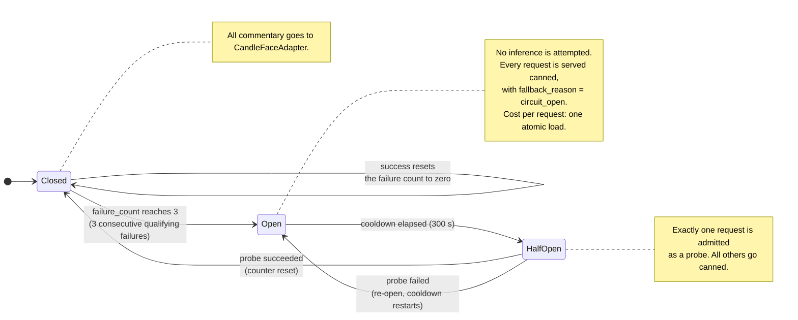
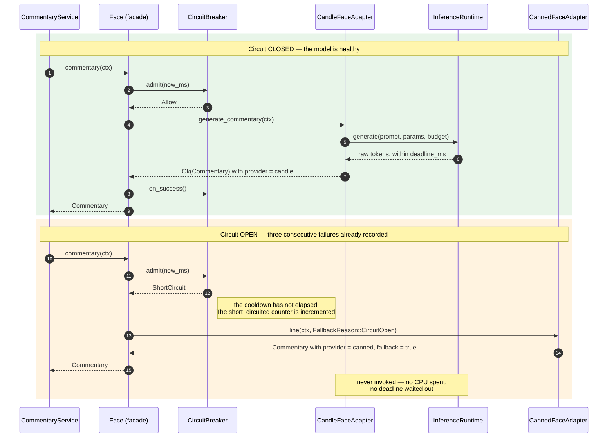

# 7. Pluggable "Face" / LLM Layer

The Face layer provides personality. It is isolated from the game engine, and in 1.1 it is also isolated from gameplay *latency* by a circuit breaker.

---

## 7.1 Design Goals

- Model-agnostic.
- Provider-agnostic.
- Safe by default.
- Non-blocking.
- Optional.
- Easily disabled.
- **In-process: no daemon, no socket, no REST hop.**
- **Device-agnostic**: the same code path runs on CUDA or on the CPU, chosen once at startup ([§7.4.1](#741-device-selection)), and a missing GPU is a fallback rather than a failure.
- **Amputatable at runtime**: a failing model must degrade to canned lines within milliseconds and stay degraded until it is plausibly healthy again.
- Never authoritative over game state.

---

## 7.2 Face Adapter Trait

Unchanged from v1.0 in shape. The trait was already provider-agnostic, which is exactly why replacing Ollama with Candle touches no caller.

```rust
#[async_trait::async_trait]
pub trait FaceAdapter: Send + Sync {
    fn name(&self) -> &'static str;

    async fn generate_commentary(
        &self,
        context: &CommentaryContext,
    ) -> Result<Commentary, FaceError>;

    fn is_available(&self) -> bool;
}
```

---

## 7.3 Commentary Context

The context is intentionally narrow.

```rust
pub struct CommentaryContext {
    pub event: CommentaryEvent,
    pub tone: Tone,
    pub ply: u32,
    pub side_to_move: Side,
    pub material_difference: i32,
    pub game_status: GameStatusSummary,
    pub max_tokens: u32,
}

pub enum CommentaryEvent {
    GameStart,
    HumanMove,
    CpuMove,
    Capture,
    MultiCapture,
    Promotion,
    Win,
    Loss,
    Draw,
    IdleTaunt,
}

pub enum Tone {
    Neutral,
    Playful,
    Sarcastic,
    Competitive,
}
```

The context deliberately excludes:

- Legal move lists.
- MCTS node values.
- Search tree internals.
- Transposition table statistics.
- Board coordinates unless absolutely needed.
- Any instruction asking the LLM to choose an action.

`CommentaryContext` is an owned value with no lifetimes and no references into engine memory. Because the model now runs in the same address space as the engine, this is a load-bearing property rather than a stylistic one: there is no borrow that could give the Face layer a view of anything it should not see.

---

## 7.4 Candle Inference Runtime — Replaces the Ollama REST Adapter

The `OllamaFaceAdapter` from v1.0 is **deleted**, along with the `reqwest` dependency it required, the `base_url` configuration key, and the JSON request/response handling.

```rust
use candle_core::{Device, Tensor};
use candle_transformers::models::{quantized_llama, quantized_qwen2};
use tokenizers::Tokenizer;

pub struct CandleFaceAdapter {
    /// Serialises access to the model. Inference is single-threaded by
    /// design: the KV cache is mutable state, and a second concurrent
    /// request would corrupt it.
    inference: Arc<InferenceRuntime>,
    params: SamplingParams,
    budget: InferenceBudget,
}

pub struct InferenceRuntime {
    /// Architecture-dispatched at load time; see the loader note below.
    model: Mutex<LoadedModel>,
    tokenizer: Tokenizer,
    /// Resolved once, in one place, by `select_device` (§7.4.1).
    /// Every tensor in this runtime lives on it.
    device: Device,
    /// What `select_device` actually returned, and why. Reported on
    /// /health so "is it on the GPU?" is answerable without reading logs.
    device_kind: DeviceKind,
    model_id: String,
    /// Bounded queue. When full, requests fail fast rather than queueing;
    /// a taunt that arrives late is worthless.
    queue_depth: AtomicUsize,
    max_queue_depth: usize,
}

pub struct SamplingParams {
    pub temperature: f32,
    pub top_p: f32,
    pub repeat_penalty: f32,
    pub repeat_last_n: usize,
    pub max_tokens: u32,
    pub seed: u64,
}

pub struct InferenceBudget {
    /// Hard wall-clock ceiling, checked between decoded tokens.
    pub deadline_ms: u64,
    /// Hard token ceiling regardless of the model's own stop tokens.
    pub max_tokens: u32,
}
```

**The loader is architecture-specific, and the runtime dispatches on the GGUF rather than pinning one.** Each quantized model family in `candle-transformers` exposes its own `ModelWeights` type reading its own GGUF metadata prefix: `quantized_llama` reads `llama.*`, `quantized_qwen2` reads `qwen2.*`. The types are structurally identical and share no trait, so a GGUF from one family cannot be loaded by another's loader no matter how similar the architectures look.

Verified against **`candle-transformers = "0.11"`**, the quantized loaders relevant to this project are:

| Module | Covers | Status here |
|---|---|---|
| `quantized_qwen2` | Qwen2 / Qwen2.5, all sizes | **Default.** Backs the whole ladder in [§7.5](#75-model-selection-and-memory-budget) |
| `quantized_llama` | Llama 2/3 and the many GGUFs that declare `llama` | **Supported.** The most common architecture in the wild |
| `quantized_qwen3`, `quantized_gemma3`, `quantized_phi3`, `quantized_mistral` | as named | Available; not wired up. One enum variant each |

All expose the same three methods, which is what makes dispatch cheap:

```rust
pub fn from_gguf<R: Seek + Read>(ct: Content, reader: &mut R, device: &Device) -> Result<Self>
pub fn clear_kv_cache(&mut self)
pub fn forward(&mut self, x: &Tensor, index_pos: usize) -> Result<Tensor>
```

`clear_kv_cache` is what makes the per-request cache reset in [§7.5](#75-model-selection-and-memory-budget) implementable rather than aspirational.

The runtime therefore holds an enum, not a concrete loader:

```rust
use candle_core::quantized::gguf_file;
use candle_transformers::models::{quantized_llama, quantized_qwen2};

/// One variant per supported GGUF architecture. Adding a family is one
/// variant and two match arms; it is deliberately not a trait, because
/// there is no out-of-crate implementor to abstract over.
pub enum LoadedModel {
    Qwen2(quantized_qwen2::ModelWeights),
    Llama(quantized_llama::ModelWeights),
}

impl LoadedModel {
    /// Dispatch on the file's own declared architecture. This is the only
    /// place the mapping from GGUF metadata to loader exists.
    fn from_gguf<R: std::io::Seek + std::io::Read>(
        content: gguf_file::Content,
        reader: &mut R,
        device: &Device,
    ) -> Result<Self, FaceError> {
        let arch = content
            .metadata
            .get("general.architecture")
            .and_then(|v| v.to_string().ok())
            .ok_or(FaceError::ModelArchitectureMissing)?
            .to_string();

        match arch.as_str() {
            "qwen2" => Ok(Self::Qwen2(quantized_qwen2::ModelWeights::from_gguf(content, reader, device)?)),
            "llama" => Ok(Self::Llama(quantized_llama::ModelWeights::from_gguf(content, reader, device)?)),
            // Never guess. A near-miss loader does not fail cleanly: it
            // produces a cryptic tensor-shape error, or worse, a model that
            // loads and emits noise.
            other => Err(FaceError::UnsupportedArchitecture {
                found: other.to_string(),
                supported: &["qwen2", "llama"],
            }),
        }
    }

    fn forward(&mut self, x: &Tensor, index_pos: usize) -> candle_core::Result<Tensor> {
        match self {
            Self::Qwen2(m) => m.forward(x, index_pos),
            Self::Llama(m) => m.forward(x, index_pos),
        }
    }

    fn clear_kv_cache(&mut self) {
        match self {
            Self::Qwen2(m) => m.clear_kv_cache(),
            Self::Llama(m) => m.clear_kv_cache(),
        }
    }
}
```

Three properties this buys, and they are the reason it is an enum rather than a pinned `use`:

1. **[§7.5](#75-model-selection-and-memory-budget)'s claim that swapping models is a config edit becomes true**, including across families. With a compile-time loader it was true only within one architecture, which is a materially weaker promise than the one the document made.
2. **The architecture check is free rather than bolted on.** `general.architecture` is read in order to dispatch, so an unsupported file fails at load with a message naming what was found and what is supported — not with a shape mismatch forty tensors in.
3. **Adding Gemma 3 or Phi-3 is one variant and two match arms.** No redesign, no trait, and the decision of which families to support stays visible in one `match` instead of spread across a build configuration.

`quantized_qwen2::ModelWeights` does not implement `Clone` (its Llama counterpart does). Nothing here needs it: the model is owned by a `Mutex` inside `InferenceRuntime` and never copied.

### 7.4.1 Device Selection

**New in 1.4.** Through 1.3 this was a single line — `let device = Device::Cpu;` — held open deliberately as the GPU seam ([§19.6.5](19-extensibility-roadmap.md#1965-what-the-mvp-must-preserve)). The target host has a CUDA 13.2 stack and an RTX 3050, and [§0.4.3](00-revision-history.md#043-consequence-two--the-cpu-inference-path-cannot-meet-its-own-deadline) shows the CPU path missing its own deadline at the 1.3 default model, so the seam is now used.

It is still one function, called from one place. That is the property worth protecting, not the value it returns.

```rust
#[derive(Clone, Copy, PartialEq, Eq, Debug)]
pub enum DeviceKind { Cpu, Cuda { ordinal: usize } }

#[derive(Clone, Copy, PartialEq, Eq, Debug)]
pub enum DeviceRequest {
    /// Force CPU. Always available, on every build.
    Cpu,
    /// Prefer CUDA; fall back to CPU with a warning if unavailable.
    Auto,
    /// Prefer CUDA; fall back to CPU with a warning if unavailable.
    /// Identical behaviour to Auto — the distinction is documentary,
    /// so an operator's intent is visible in the config file.
    Cuda { ordinal: usize },
}

/// The ONLY place in the tree that constructs a `candle_core::Device`.
/// A second one is a review-blocking defect (§19.6.5 property 1).
pub fn select_device(req: DeviceRequest) -> (Device, DeviceKind) {
    match req {
        DeviceRequest::Cpu => (Device::Cpu, DeviceKind::Cpu),

        #[cfg(feature = "cuda")]
        DeviceRequest::Auto | DeviceRequest::Cuda { .. } => {
            let ordinal = req.ordinal().unwrap_or(0);
            match Device::new_cuda(ordinal) {
                Ok(d) => (d, DeviceKind::Cuda { ordinal }),
                // No driver, no card, card busy, CUDA init failed: all the
                // same answer. A GPU that is not there is not an error.
                Err(e) => {
                    tracing::warn!(error = %e, ordinal,
                        "CUDA requested but unavailable; falling back to CPU. \
                         Check face.model_path against the CPU profile in §7.5.");
                    (Device::Cpu, DeviceKind::Cpu)
                }
            }
        }

        // Built without the feature: the request is honoured as far as it
        // can be, and the mismatch is logged once at startup, not per request.
        #[cfg(not(feature = "cuda"))]
        DeviceRequest::Auto | DeviceRequest::Cuda { .. } => {
            tracing::warn!("face.device requests CUDA but this binary was built \
                            without --features cuda; using CPU");
            (Device::Cpu, DeviceKind::Cpu)
        }
    }
}
```

Four rules govern this function, and each exists to prevent a specific failure:

1. **A missing, busy, or broken GPU is never an error.** It degrades to CPU, exactly as a failing model degrades to canned lines ([§7.8](#78-circuit-breaker--new-in-11)). A build that refuses to start without a GPU has converted an optional feature into a hard dependency, which is what [§2.3](02-scope-and-constraints.md#23-explicit-constraint-llm-does-not-play-draughts) exists to prevent.
2. **CUDA is a cargo feature, never a runtime assumption.** `cargo build --release` with no features produces a binary with no CUDA dependency that links and runs on a machine with no driver. `--features cuda` is opt-in, and CI builds and tests both.
3. **The fallback is loud exactly once.** One `warn!` at startup and a `face.device` field on `/health` ([§9.2](09-api-contract.md#92-health-endpoint)). Not one line per commentary request.
4. **The fallback does not change the model.** This is the sharp edge. `face.model_path` names one file; if it names the 1.5B GGUF and the GPU vanishes, commentary now runs a 4.3-second model against a 2.5-second deadline and the circuit opens within three moves — a *correct* degradation that produces a silent outage. [§7.5](#75-model-selection-and-memory-budget) therefore specifies a `[face.cpu_profile]` block, and startup validation refuses a configuration whose CPU profile cannot meet its own deadline ([§23](23-configuration-example.md)).

**Build notes for the target host.** The card is compute capability 8.6, so `CUDA_COMPUTE_CAP=86` should be set for the build. Driver 595.84 supports CUDA 13.2 and, by CUDA's forward-compatibility guarantee, every earlier toolkit — so if `cudarc`'s supported toolkit range lags 13.x, installing a 12.x toolkit alongside is the fix, not a driver change. Verify the pairing at build time; a toolkit/driver mismatch is a link error, which is the good kind of failure.

Loading happens once, at startup or on first use:

```rust
impl InferenceRuntime {
    pub fn load(cfg: &FaceConfig) -> Result<Self, FaceError> {
        // One call, one place. See §7.4.1.
        let (device, device_kind) = select_device(cfg.device);

        // If the device fell back to CPU, so must the model choice —
        // otherwise a 4.3 s model meets a 2.5 s deadline. See §7.5.
        let profile = cfg.profile_for(device_kind);

        // On CPU the GGUF is memory-mapped and the OS pages weights in on
        // demand. On CUDA the quantized tensors are copied to VRAM at load,
        // which is why `warm_on_start` matters more, not less, on the GPU.
        let mut file = std::fs::File::open(&profile.model_path)?;
        let content = candle_core::quantized::gguf_file::Content::read(&mut file)?;
        let model = LoadedModel::from_gguf(content, &mut file, &device)?;

        let tokenizer = Tokenizer::from_file(&profile.tokenizer_path)
            .map_err(FaceError::Tokenizer)?;

        Ok(Self {
            model: Mutex::new(model),
            tokenizer,
            device,
            device_kind,
            model_id: profile.model_id.clone(),
            queue_depth: AtomicUsize::new(0),
            max_queue_depth: cfg.max_queue_depth,
        })
    }
}
```

A CUDA out-of-memory at load is a `FaceError::ModelNotLoaded`, which leaves the breaker permanently open and the service on canned lines ([§17.2](17-reliability.md#172-face-failures)). It is **not** a silent retry on the CPU: a model chosen for VRAM is the wrong model for two Broadwell cores, and quietly running it there reproduces exactly the defect rule 4 above exists to prevent. The operator gets a startup error naming the VRAM figure and the budget in [§16.6](16-memory-strategy.md#166-vram-budget--new-in-14).

Generation runs on a dedicated OS thread, never on a Tokio worker and never on an MCTS worker:

```rust
#[async_trait::async_trait]
impl FaceAdapter for CandleFaceAdapter {
    fn name(&self) -> &'static str { "candle" }

    async fn generate_commentary(
        &self,
        context: &CommentaryContext,
    ) -> Result<Commentary, FaceError> {
        if self.inference.queue_depth.load(Ordering::Relaxed) >= self.inference.max_queue_depth {
            return Err(FaceError::Saturated);
        }

        let prompt = build_prompt(context);          // §18.2, no move data, ever
        let budget = self.budget;
        let params = self.params;
        let runtime = Arc::clone(&self.inference);

        // Own thread pool, sized in §15.4. Not the Tokio blocking pool:
        // a stuck inference must not consume general-purpose blocking slots.
        let raw = inference_pool()
            .spawn_with_deadline(budget.deadline_ms, move || {
                runtime.generate(&prompt, &params, &budget)
            })
            .await
            .map_err(|_| FaceError::Timeout)??;

        Ok(Commentary {
            text: sanitize_and_truncate(&raw),       // §18.3
            provider: "candle",
            fallback: false,
        })
    }

    fn is_available(&self) -> bool {
        self.inference.model_loaded()
    }
}
```

Three properties of this design matter more than the code:

1. **The deadline is enforced by the caller, and the generation loop checks it between tokens.** A model that is merely slow is cut off cleanly at a token boundary and its partial output discarded, rather than being abandoned while still holding the model lock.
2. **There is no retry.** A failure is reported once, to the circuit breaker, which decides policy. Retrying an overloaded in-process model with the engine competing for the same cores is how a slow taunt becomes an unresponsive server.
3. **Saturation is a distinct error from failure.** `FaceError::Saturated` means the queue was full — expected under lab load, not evidence that the model is broken, and (per [§7.8](#78-circuit-breaker--new-in-11)) it does not count toward tripping the circuit.

---

## 7.5 Model Selection and Memory Budget

Model choice has never been dictated by capacity here. It is dictated by **bandwidth**, and 1.4 changes which bandwidth, because the Face layer now has two device profiles rather than one.

**The relation that sizes everything.** Token generation is memory-bandwidth-bound, not compute-bound: each decoded token reads the whole weight set once. So

```text
tokens/sec  ≈  effective read bandwidth / resident weight bytes
```

Everything below is that relation applied to two devices. The numbers are estimates, replaced by measurements in [§20.9](20-testing-strategy.md#209-performance-regression-baselines) as soon as there is a build to measure; the *ordering* is what matters and it is robust.

### 7.5.1 What the Two Devices Actually Deliver

| | Effective read bandwidth | Where the number comes from |
|---|---|---|
| **2 CPU cores, this host** | **12–18 GB/s** (use 15) | Two populated DDR4-2400 channels give ~38 GB/s for the *entire socket* ([§2.4](02-scope-and-constraints.md#24-hardware-baseline)). Two Broadwell cores cannot claim half of it, and are competing with ten MCTS workers hammering a 24 GB hash table |
| **RTX 3050, 6 GB** | **~168 GB/s** nameplate; assume 50–60 % realised through Candle | 96-bit GDDR6 at 14 Gbps. Candle's quantized CUDA kernels are not llama.cpp's; the discount is deliberate and conservative |

The ratio is roughly **10×**, and it is the entire argument for [§0.4.4](00-revision-history.md#044-consequence-three--cuda-stops-being-a-roadmap-item).

Note what changed from 1.3 and why it is not a rounding error. §7.5 previously assumed two cores could reach **35 GB/s**. On this host that is not optimistic, it is *above the platform ceiling*: 35 GB/s exceeds what all fourteen cores can obtain together on two channels. Every CPU latency figure in 1.3 was therefore low by a factor of roughly 2.3.

### 7.5.2 The CUDA Ladder — the Default Profile

VRAM is the constraint, and it is a hard one: 6 GB nameplate, **~5.0 GB usable** with a desktop session attached, budgeted in [§16.6](16-memory-strategy.md#166-vram-budget--new-in-14).

| Model | Quant. | Weights | + KV & context | ≈ tok/s | 64 tokens | Verdict |
|---|---|---|---|---|---|---|
| Qwen2.5-0.5B-Instruct | Q4_K_M | ~0.4 GB | ~1.0 GB | ~200 | ~0.3 s | Works, but there is no reason to choose it here |
| **Qwen2.5-1.5B-Instruct** | **Q4_K_M** | **~1.0 GB** | **~1.8 GB** | **~45–90** | **~0.8–1.5 s** | **Recommended default.** Comfortably inside `deadline_ms = 2500`, comfortably inside the VRAM budget |
| Qwen2.5-7B-Instruct | Q4_K_M | ~4.4 GB | **~5.2 GB** | ~20 | ~3.2 s | **Does not fit** alongside a desktop session, and would need `deadline_ms ≥ 5000` if it did. Headless-card option only |
| Qwen2.5-14B-Instruct | Q4_K_M | ~9.0 GB | — | — | — | **No.** Exceeds VRAM outright |

The honest summary of the GPU: it does not buy a *bigger* model on this card — 6 GB caps that at the 1.5B–3B class once the desktop's share is deducted. What it buys is the 1.5B model **meeting its deadline**, and the CPU cores back.

### 7.5.3 The CPU Ladder — the Fallback Profile

This is not a hypothetical path. It is what runs on a machine with no CUDA build, no driver, or a busy card ([§7.4.1](#741-device-selection)), and it must be independently correct.

| Model | Quant. | Resident | ≈ tok/s at 15 GB/s | 64 tokens | Verdict against `deadline_ms = 2500` |
|---|---|---|---|---|---|
| **Qwen2.5-0.5B-Instruct** | **Q4_K_M** | **~0.4 GB** | **~37** | **~1.7 s** | **Recommended CPU default.** The only size with real margin |
| Qwen2.5-1.5B-Instruct | Q4_K_M | ~1.0 GB | ~15 | ~4.3 s | **Misses by 1.7×.** Viable only at `deadline_ms ≥ 6000` |
| Qwen2.5-7B-Instruct | Q5_K_M | ~5.4 GB | ~2.8 | ~23 s | Not on this host, at any deadline worth having |

**A model that cannot meet its deadline is indistinguishable from a model that is down.** Three consecutive misses open the circuit for five minutes ([§7.8](#78-circuit-breaker--new-in-11)), the system serves canned lines permanently, and `/health` reports a model that is loaded and healthy. That failure is why 1.3 exists; re-deriving the bandwidth for the real host is what stops 1.4 from shipping it again under a different number.

### 7.5.4 Two Profiles, Not One Model Path

The device can change between one boot and the next without anyone editing configuration — a driver update, an X session claiming VRAM, a binary built without the feature. If `model_path` were a single key, that change would silently substitute a 4.3-second model into a 2.5-second budget.

So the configuration carries both profiles, and the runtime picks the one matching the device it actually got:

```toml
[face]
device      = "auto"          # "cuda" | "cpu" | "auto"
deadline_ms = 2500

[face.cuda_profile]
model_path     = "./models/qwen2.5-1.5b-instruct-q4_k_m.gguf"
tokenizer_path = "./models/qwen2.5-1.5b-instruct/tokenizer.json"
model_id       = "qwen2.5-1.5b-instruct-q4_k_m"

[face.cpu_profile]
model_path     = "./models/qwen2.5-0.5b-instruct-q4_k_m.gguf"
tokenizer_path = "./models/qwen2.5-0.5b-instruct/tokenizer.json"
model_id       = "qwen2.5-0.5b-instruct-q4_k_m"
```

Both `.gguf` files are on disk; together they are ~1.4 GB, which is not a meaningful deployment cost and is far cheaper than a silent outage. A deployment that genuinely wants one model sets `device = "cpu"` and points both profiles at the same file — an explicit choice rather than an accident.

Startup validation checks each profile against the deadline using the relation in [§7.5.1](#751-what-the-two-devices-actually-deliver), and refuses a configuration whose *fallback* profile cannot meet it ([§23](23-configuration-example.md)). A configuration that only works when the GPU is present should fail at boot, not at the first driver hiccup.

### 7.5.5 Why Small, Regardless of Device

The Face layer emits 40 to 100 tokens of flavour text with no reasoning, no tool use, and no memory across requests. It is a parrot with a personality, and the job does not improve in proportion to parameters. What does scale with parameters is latency. The GPU raises the ceiling on this host from 0.5B to 1.5B; it does not make 7B a good idea on a 6 GB card that is also driving a display.

**Licensing is a selection criterion, not an afterthought.** Qwen2.5 at 0.5B, 1.5B, 7B and 14B is Apache 2.0. **Qwen2.5-3B is not** — it ships under the Qwen Research License — which is why the ladder skips from 1.5B to 7B rather than stepping through the obvious intermediate, and why 3B is absent from the CUDA table despite fitting the VRAM budget well. Any substitute must have its licence checked against redistribution before it becomes a default, because the project is MIT and the recommended default is the one people will actually ship.

### 7.5.6 Memory

Two budgets on two devices, and they must not be added together:

- **Host RAM: 2 GB** ([§16.1](16-memory-strategy.md#161-memory-budget)) — tokenizer, prompt and staging buffers, and enough room to hold the CPU-profile weights when the fallback path is live. It is small because the default path keeps the weights on the card.
- **VRAM: 4.5 GB of a ~5.0 GB usable budget** ([§16.6](16-memory-strategy.md#166-vram-budget--new-in-14)) — quantized weights, KV cache, CUDA context and cuBLAS workspace.

The 6 GB released against the 1.3 host budget did not go to the transposition table; the table lost 8 GB in the move to 64 GB and gets none of it back. It went to the reserve, which is where a halved host most needs it.

Practical notes:

- **`warm_on_start = true` matters more on CUDA, not less.** On CPU it pays a page-in cost. On CUDA it performs the host-to-device copy and the first kernel launch, both of which are slow and both of which would otherwise land on the first player's first taunt.
- The KV cache is reset between commentary requests. Sessions are not carried across events; each taunt is independent, which bounds memory — on both devices — and removes an entire category of prompt-contamination bugs.
- Model and tokenizer paths are configuration, not compile-time constants. Swapping models within a profile is a config edit and a restart, not a rebuild. Swapping to a *different architecture* is likewise config, via the loader dispatch in [§7.4](#74-candle-inference-runtime--replaces-the-ollama-rest-adapter).
- A larger model must be paired with a larger `deadline_ms`, on either device. Raising the model without raising the deadline converts a working system into a permanently open circuit, and it remains the single easiest way to misconfigure this layer.

---

## 7.6 Provider Abstraction

The `FaceAdapter` trait still admits alternative providers. What changed is which one is the default and which are the escape hatches:

- **`candle` — in-process quantized GGUF. Default.**
- `canned` — offline canned-response fallback. Always compiled in; always available; the circuit breaker's target.
- `openai_compatible` — optional, feature-gated, for development against a hosted model. Not built into release binaries by default.

Ollama, llama.cpp-server, and "local HTTP inference service" are removed as first-class options. They can be reintroduced behind the same trait if a deployment ever needs them, but carrying them in the MVP means carrying an HTTP client, a retry policy, and a second set of failure semantics for no benefit on a single machine.

Configuration example:

```toml
[face]
enabled          = true
provider         = "candle"                                   # was "ollama"
device           = "auto"                                     # new in 1.4, §7.4.1
warm_on_start    = true
deadline_ms      = 2500
max_tokens       = 80
max_queue_depth  = 2
fallback         = "canned"
verbosity        = "low"

# Model paths live in the per-device profiles, §7.5.4.
[face.cuda_profile]
model_path       = "./models/qwen2.5-1.5b-instruct-q4_k_m.gguf"
tokenizer_path   = "./models/qwen2.5-1.5b-instruct/tokenizer.json"
model_id         = "qwen2.5-1.5b-instruct-q4_k_m"

[face.cpu_profile]
model_path       = "./models/qwen2.5-0.5b-instruct-q4_k_m.gguf"
tokenizer_path   = "./models/qwen2.5-0.5b-instruct/tokenizer.json"
model_id         = "qwen2.5-0.5b-instruct-q4_k_m"

[face.sampling]
temperature      = 0.7
top_p            = 0.9
repeat_penalty   = 1.1
repeat_last_n    = 64
seed             = 0        # 0 = derive per request; set non-zero for reproducible taunts

[face.circuit_breaker]
failure_threshold  = 3       # consecutive failures before opening
cooldown_seconds   = 300     # 5 minutes open
half_open_probes   = 1       # single trial request before closing
```

Note the absence of `base_url`. There is no URL.

---

## 7.7 Commentary Guardrails

The Face layer must enforce:

1. **No move generation.**
   - Prompts never ask for moves.
   - Legal moves are not included in prompts.

2. **Output length limits.**
   - MVP default: 40 to 100 tokens, enforced by `InferenceBudget::max_tokens` independently of the model's own stop tokens.

3. **Deadline enforcement.**
   - A wall-clock deadline checked between decoded tokens. On expiry the partial output is discarded and the canned fallback is used.

4. **Sanitization.**
   - Strip control characters.
   - Collapse whitespace.
   - Truncate to max display length.
   - HTML-escape before rendering ([§18.3](18-security-and-safety.md#183-output-sanitization)).

5. **Rate limiting.**
   - Avoid commentary after every move in fast lab mode.
   - In Play Mode, event-based commentary only.
   - A minimum interval between taunts, so an idle-taunt poller cannot pin the inference thread.

6. **Failure isolation.**
   - LLM failure never fails a game move.
   - Commentary is best-effort.

7. **Circuit breaking — new in 1.1.**
   - Repeated failure removes the model from the request path entirely, rather than being retried per move. Specified below.

Guardrails 1 through 6 were correct in v1.0 and are unchanged. Guardrail 7 exists because moving inference in-process changed the cost of a failure: an unreachable HTTP daemon fails in microseconds, but an overloaded in-process model fails *slowly*, by consuming CPU that the engine needs, and it does so once per move for as long as it stays unhealthy.

---

## 7.8 Circuit Breaker — New in 1.1

### 7.8.1 Why

Commentary is optional; gameplay is not. Without a breaker, a model that has begun timing out imposes its full deadline on every subsequent commentary attempt — 2.5 s per move, forever, plus the CPU burned producing output that is then thrown away. The breaker converts a persistent fault into a single cheap decision.

### 7.8.2 States



| State | Behavior | Exit condition |
|---|---|---|
| `Closed` | All commentary requests go to `CandleFaceAdapter`. Consecutive failures are counted; any success resets the count to zero. | 3 consecutive failures → `Open` |
| `Open` | **No inference is attempted.** Every request is served by `CannedFaceAdapter` immediately, with `fallback: true` and `fallback_reason: "circuit_open"`. Cost per request: one atomic load. | 300 s elapsed → `HalfOpen` |
| `HalfOpen` | Exactly one request is allowed through as a probe; all others continue to the fallback. | Probe succeeds → `Closed` (counter reset). Probe fails → `Open`, cooldown restarts. |

### 7.8.3 What Counts as a Failure

This distinction is the difference between a breaker that protects the system and one that trips constantly under normal load:

| Outcome | Counts toward threshold | Rationale |
|---|---|---|
| `FaceError::Timeout` — deadline exceeded | **Yes** | The model cannot meet its latency contract |
| `FaceError::Inference` — Candle returned an error | **Yes** | Model or runtime fault |
| `FaceError::ModelNotLoaded` | **Yes** | Startup failed, the file went away, or the model would not fit in VRAM ([§7.4.1](#741-device-selection)) |
| `FaceError::Saturated` — request queue full | No | Expected backpressure under lab load; the model is healthy |
| `FaceError::Disabled` — Face turned off in config | No | Not a failure; the breaker is not consulted at all |
| Empty output after sanitization | **Yes** | A model producing nothing usable is failing, quietly |

### 7.8.4 Implementation

The breaker is a small, lock-free wrapper. It sits in front of the adapters and is the only thing `CommentaryService` talks to.

```rust
pub struct CircuitBreaker {
    state: AtomicU8,                 // 0 = Closed, 1 = Open, 2 = HalfOpen
    consecutive_failures: AtomicU32,
    opened_at_ms: AtomicU64,         // monotonic millis since process start
    half_open_token: AtomicBool,     // single-probe admission
    failure_threshold: u32,
    cooldown_ms: u64,
    // Counters for /health and face_events.
    trips: AtomicU64,
    short_circuited: AtomicU64,
}

impl CircuitBreaker {
    /// Cheap enough to call on every commentary request.
    pub fn admit(&self, now_ms: u64) -> Admission {
        match self.load_state() {
            State::Closed => Admission::Allow,
            State::Open => {
                if now_ms.saturating_sub(self.opened_at_ms.load(Ordering::Acquire)) >= self.cooldown_ms {
                    self.transition_to_half_open();
                    self.try_take_probe_token()
                } else {
                    self.short_circuited.fetch_add(1, Ordering::Relaxed);
                    Admission::ShortCircuit
                }
            }
            State::HalfOpen => self.try_take_probe_token(),
        }
    }

    pub fn on_success(&self) {
        self.consecutive_failures.store(0, Ordering::Release);
        self.state.store(State::Closed as u8, Ordering::Release);
        self.half_open_token.store(true, Ordering::Release);
    }

    pub fn on_failure(&self, now_ms: u64, err: &FaceError) {
        if !err.counts_toward_trip() {
            return;                                   // see §7.8.3
        }
        let n = self.consecutive_failures.fetch_add(1, Ordering::AcqRel) + 1;
        if n >= self.failure_threshold || self.load_state() == State::HalfOpen {
            self.opened_at_ms.store(now_ms, Ordering::Release);
            self.state.store(State::Open as u8, Ordering::Release);
            self.trips.fetch_add(1, Ordering::Relaxed);
        }
    }
}
```

The facade that every caller sees:

```rust
pub struct Face {
    primary: Arc<dyn FaceAdapter>,     // CandleFaceAdapter
    fallback: Arc<CannedFaceAdapter>,  // infallible by construction
    breaker: Arc<CircuitBreaker>,
    clock: Arc<dyn MonotonicClock>,    // injectable, so §20.7 can test without sleeping
}

impl Face {
    pub async fn commentary(&self, ctx: &CommentaryContext) -> Commentary {
        let now = self.clock.now_ms();

        if self.breaker.admit(now) == Admission::ShortCircuit {
            return self.fallback.line(ctx, FallbackReason::CircuitOpen);
        }

        match self.primary.generate_commentary(ctx).await {
            Ok(c) => {
                self.breaker.on_success();
                c
            }
            Err(e) => {
                self.breaker.on_failure(self.clock.now_ms(), &e);
                self.fallback.line(ctx, FallbackReason::from(&e))
            }
        }
    }
}
```

`Face::commentary` returns `Commentary`, not `Result<Commentary, _>`. There is no error path for a caller to mishandle, because from the game's point of view commentary cannot fail — it can only be less interesting. Making that a type-level fact is what guarantees the constraint in [§7.7.6](#77-commentary-guardrails).

The same call, in both circuit states, with the game move that provoked it:



### 7.8.5 Observability

Every trip, every short-circuit, and every half-open probe is recorded as a `face_events` row ([§12](12-database-schema.md)) with `fallback_used = 1` and the reason in `event_type`. The current state is exposed on `/api/v1/health` ([§9.2](09-api-contract.md#92-health-endpoint)), alongside the resolved `device` and `vram_mb`, so an operator can answer "is the model live, and is it on the card I think it is?" without reading logs. Circuit state is also surfaced in the UI as a small, unobtrusive indicator — not an error banner. A game played entirely against canned lines is a fully valid game.

---

## 7.9 Fallback Provider

```rust
pub struct CannedFaceAdapter {
    lines: HashMap<(CommentaryEvent, Tone), Vec<&'static str>>,
    rng: Mutex<SmallRng>,
}
```

Used when:

- **The circuit is open** (the common case in 1.1).
- The GPU was requested but the model would not load on it, and the CPU profile also failed.
- Inference times out or errors.
- The inference queue is saturated.
- The model failed to load at startup.
- Face is disabled by configuration.
- Lab mode is running.

Requirements:

- Compiled into the binary as static data. It must work with no model file, no configuration, and no disk access.
- Covers every `(CommentaryEvent, Tone)` pair, so there is no combination that produces silence.
- Deterministic given a seed, so UI tests are stable.

The canned adapter is infallible by construction. That is what allows `Face::commentary` to have no error path.

---

← [6. Rust MCTS Extensibility Design](06-mcts-extensibility.md) · **[Index](README.md)** · [8. Game Modes and Execution Flows](08-game-modes-and-flows.md) →
