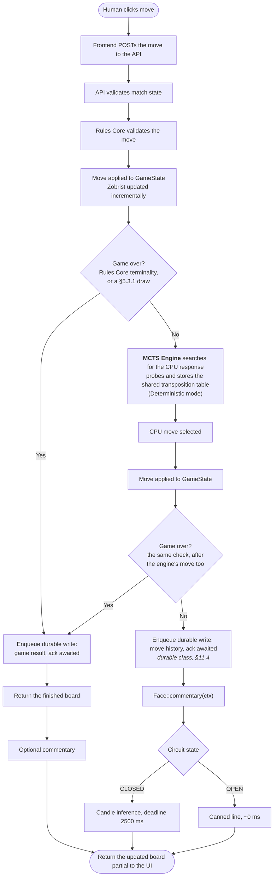
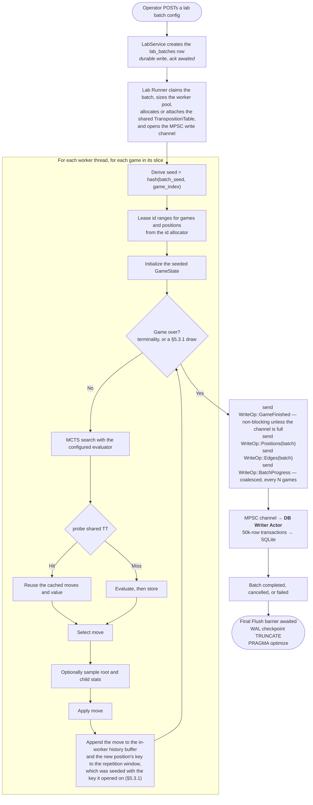

# 8. Game Modes and Execution Flows

## 8.1 Human vs. CPU — Play Mode

Important constraints:

- Human move validation is always done by Rules Core.
- **The two draw rules are adjudicated here, not by `apply_move`** ([§5.3.1](05-runtime-components.md#531-draw-rules-for-mvp--new-in-15)). The match service holds the Zobrist keys seen since the last capture or promotion and checks them, and reads `GameState.non_progress_plies` against the configured threshold, after every applied move — its own and the engine's. The Rules Core reports only that the side to move has no move.
- CPU move is chosen only by MCTS.
- LLM commentary is generated after state transition, not before.
- If the model fails, the game continues unaffected and the breaker absorbs the fault.
- Play Mode writes use the **durable** write class ([§11.4](11-database-architecture.md#114-durability-classes--new-in-11)): the response is not returned until the writer actor has committed. A human's game is not regenerable data, and it is a handful of rows per move — there is no throughput argument for buffering it.

## 8.2 CPU vs. CPU — Training Lab Mode

Training Lab does not invoke the LLM. `face.lab_mode_enabled` defaults to `false`, and the breaker is not consulted at all.

Two things a lab worker cannot do, by construction: open a database connection, and begin a transaction. It has neither a connection handle nor the API to obtain one. Everything it wants persisted goes into the channel.

---

← [7. Pluggable "Face" / LLM Layer](07-face-llm-layer.md) · **[Index](README.md)** · [9. API Contract](09-api-contract.md) →
