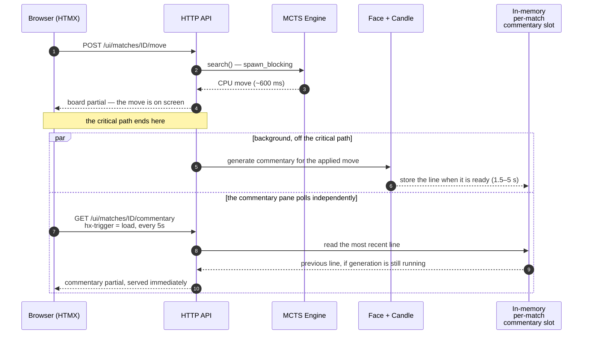

# 10. Frontend Architecture

The frontend is deliberately simple, and 1.1 does not complicate it.

## 10.1 Pages

| Route | Purpose |
|---|---|
| `/` | Landing page, start Play Mode |
| `/play/{match_id}` | Human vs. CPU board view |
| `/lab` | List lab batches |
| `/lab/{batch_id}` | Lab batch status, including writer queue depth and TT hit rate |
| `/settings` | Model, tone, and circuit-breaker status view |

---

## 10.2 Board Rendering

The server renders the board partial.

Example structure:

```html
<div id="board" class="board">
  <!-- 64 squares -->
  <div class="square dark" data-index="9">
    <button class="piece black" hx-post="/ui/matches/m_123/select?square=9">
      Black man
    </button>
  </div>

  <div class="square light" data-index="10"></div>

  <div class="square dark legal-target" data-index="13">
    <button hx-post="/ui/matches/m_123/move?from=9&amp;to=13">
      Move
    </button>
  </div>
</div>
```

Alpine.js may be used only for local selection state:

```html
<div x-data="{ selected: null }">
  <!-- minimal local interaction -->
</div>
```

The authoritative legal-move state always comes from the server.

---

## 10.3 HTMX Interaction Pattern

Move submission:

```html
<button
  hx-post="/ui/matches/m_123/move?from=9&amp;to=13"
  hx-target="#game-root"
  hx-swap="innerHTML"
  hx-indicator="#spinner"
>
  Move
</button>
```

**Commentary is decoupled from the move response.** In v1.0, commentary was returned inline with the board update. With even a 1.5B model producing ~1.8 s latencies on its 2-core budget — and a 7B quality profile producing ten times that ([§7.5](07-face-llm-layer.md#75-model-selection-and-memory-budget)) — that would put model latency directly onto the critical path of every move, which no amount of circuit breaking would fix — a *successful* slow inference is still slow.

The move response therefore returns the board immediately, and the commentary pane fetches independently:

```html
<div id="commentary"
     hx-get="/ui/matches/m_123/commentary"
     hx-trigger="load, every 5s"
     hx-swap="innerHTML">
  <span class="commentary-idle">…</span>
</div>
```

The server holds the most recent commentary per match in memory and serves it immediately; generation happens in the background after the move is applied. If generation has not finished, the pane keeps showing the previous line. This is the one place where the in-process model changes the client contract, and it is worth the change: the board now updates in the time MCTS takes, not the time the LLM takes.

For MVP, polling is acceptable. Server-sent events are not required, but are the obvious upgrade path and would remove the 5 s worst-case commentary lag.

The decoupling, drawn against the clock. The board lands at engine speed; the taunt arrives whenever it arrives:



---

← [9. API Contract](09-api-contract.md) · **[Index](README.md)** · [11. Database Architecture](11-database-architecture.md) →
