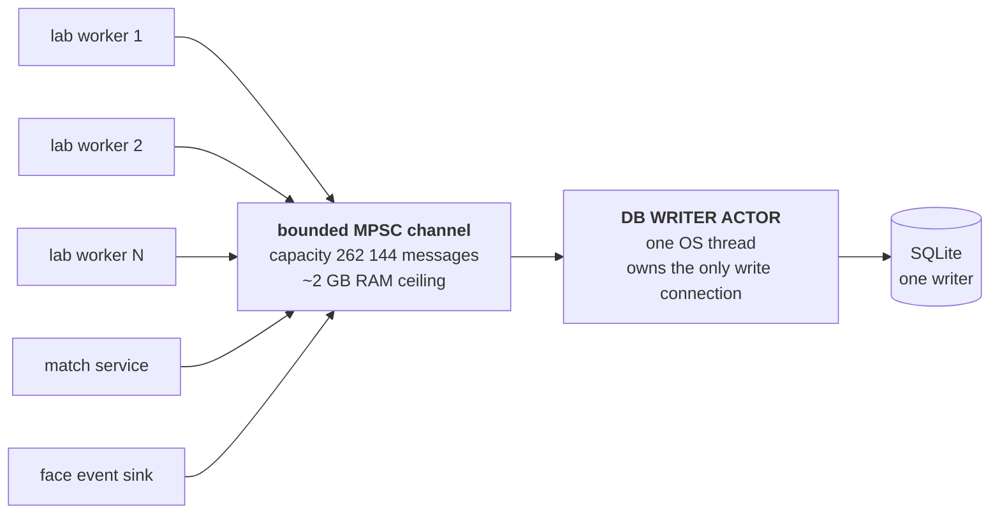
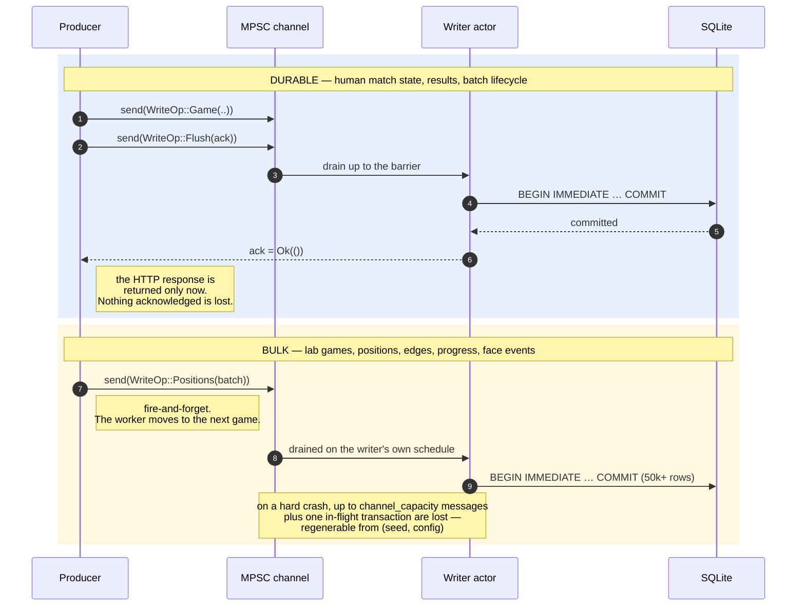

# 11. Database Architecture

SQLite is the only persistence store.

The schema is optimized for:

- Hundreds of millions of positions over time.
- Extremely large batch inserts.
- Compact move history storage.
- Sampled MCTS node evaluations.
- Simple export for future training pipelines.
- **Memory-resident working sets.**

Two ideas drive the 1.1 changes. First, if the hot part of the database fits in RAM, read cost approaches zero and the only remaining cost is writes. Second, SQLite has exactly one writer, so the only way to make writes fast is to make each write transaction enormous. Both are addressed below.

---

## 11.1 SQLite Runtime Configuration

Pragmas differ by connection role. This is a correction of a latent bug in the v1.0 configuration, which specified one pragma set: **`cache_size` is per-connection**, so applying the writer's cache to every connection in the read pool would multiply it by the pool size rather than sharing it. On the 1.4 budget that mistake would reserve 28 GB instead of 5.5 GB, on a 64 GB host.

**Writer connection** — one per process, owned by the writer actor:

```sql
PRAGMA journal_mode      = WAL;
PRAGMA synchronous       = NORMAL;
PRAGMA foreign_keys      = ON;
PRAGMA busy_timeout      = 30000;

-- Massive memory. Negative values are KiB.
PRAGMA cache_size        = -4194304;      -- 4 GiB page cache
PRAGMA temp_store        = MEMORY;        -- no temp files, ever
PRAGMA mmap_size         = 8589934592;    -- 8 GiB mmap window
PRAGMA threads           = 4;             -- helper threads for sorts/index builds

-- Checkpointing is scheduled by the writer actor, not by SQLite,
-- so a checkpoint never lands in the middle of a 50k-row transaction.
PRAGMA wal_autocheckpoint = 0;
PRAGMA journal_size_limit = 4294967296;   -- 4 GiB WAL ceiling before truncation
```

**Reader connections** — pooled, read-only:

```sql
PRAGMA query_only        = ON;
PRAGMA busy_timeout      = 5000;
PRAGMA cache_size        = -262144;       -- 256 MiB each
PRAGMA temp_store        = MEMORY;
PRAGMA mmap_size         = 8589934592;    -- mmap is shared page cache, not per-connection RSS
```

**Set once at database creation** (cannot be changed later without a `VACUUM`):

```sql
PRAGMA page_size = 8192;
```

Notes a reviewer should not have to derive:

- `cache_size = -4194304` is 4 194 304 KiB = 4 GiB. Negative means KiB; positive would mean *pages*, and `cache_size = 4194304` at an 8 KiB page size would request 32 GiB — half this host. The sign is not cosmetic.
- `mmap_size` is a virtual mapping backed by the OS page cache. It is shared, not per-connection RSS, and it is why the reader connections can afford a large window and a small private cache.
- `temp_store = MEMORY` matters most during index maintenance and `ORDER BY` on export queries. Even at 64 GB there is no reason for SQLite to create a temp file, but the reserve in [§16.1](16-memory-strategy.md#161-memory-budget) is what pays for it, and it is half what it was.
- **`mmap_size` fell from 32 GiB to 8 GiB in 1.4, and that is not a proportional rescale.** The window is virtual address space served by the OS page cache, so on a 128 GB host it was free. On a 64 GB host with 24 GB already committed to the transposition table, an oversized window competes for physical pages with the 8 GB OS reservation that exists to protect exactly those pages. 8 GiB comfortably covers the hot index and recent-position working set, which is all the window was ever buying.
- `synchronous = NORMAL` under WAL guarantees no corruption on process crash, and can lose recently committed transactions on OS/power loss. That window is accepted; [§11.4](#114-durability-classes--new-in-11) defines what is exposed to it.
- `wal_autocheckpoint = 0` moves checkpointing under our control. The writer runs `PRAGMA wal_checkpoint(PASSIVE)` every N commits and `TRUNCATE` at batch boundaries. Left on automatic, a checkpoint fires mid-batch and stalls a 50k-row commit behind readers.

Down-tuning for a smaller host is still supported, and is now a documented profile rather than an afterthought:

```sql
-- 16 GB host
PRAGMA cache_size = -1048576;    -- 1 GiB
PRAGMA mmap_size  = 2147483648;  -- 2 GiB
```

---

## 11.2 Write Strategy — MPSC Actor Pattern

SQLite supports one writer at a time. v1.0 acknowledged this and recommended "a single writer actor or dedicated write connection". v1.1 makes it the load-bearing structure of the persistence layer and specifies it precisely.

### 11.2.1 Shape



Producers are many and cheap; the consumer is one and does all the expensive work. No producer ever holds a database lock, waits on another producer, or knows that SQLite exists.

### 11.2.2 Message Type

```rust
pub enum WriteOp {
    Game(GameRecord),
    Positions(Vec<PositionRecord>),
    Edges(Vec<EdgeRecord>),
    BatchProgress { batch_id: i64, completed: u64, failed: u64, gpm: f32 },
    BatchStatus  { batch_id: i64, status: BatchStatus, at: Timestamp },
    FaceEvent(FaceEventRecord),

    /// Durability barrier. The writer commits everything ahead of it and
    /// then signals. This is how the durable write class (§11.4) works.
    Flush(oneshot::Sender<Result<(), DbError>>),

    /// Drain and stop.
    Shutdown(oneshot::Sender<()>),
}
```

Messages carry batches, not single rows. A finished lab game emits one `Positions` message containing all of its sampled positions, not one message per position. This keeps the message count proportional to games rather than rows, and is why a 524 288-slot channel can absorb a very large burst.

### 11.2.3 The Writer Loop

```rust
fn writer_thread(rx: Receiver<WriteOp>, mut conn: Connection, cfg: WriterConfig) {
    let mut buf = WriteBuffer::with_capacity(cfg.batch_rows);
    let mut commits_since_checkpoint = 0u32;

    loop {
        // Block until there is at least one message; no spinning when idle.
        let Ok(first) = rx.recv() else { break };
        buf.push(first);

        let deadline = Instant::now() + Duration::from_millis(cfg.flush_interval_ms);

        // Opportunistically drain. Stop on row count, on deadline, or when
        // the channel is momentarily empty.
        while buf.rows() < cfg.batch_rows {
            match rx.recv_deadline(deadline) {
                Ok(WriteOp::Flush(ack))    => { buf.mark_flush(ack); break }
                Ok(WriteOp::Shutdown(ack)) => { buf.mark_shutdown(ack); break }
                Ok(op)                     => buf.push(op),
                Err(RecvTimeoutError::Timeout)      => break,
                Err(RecvTimeoutError::Disconnected) => break,
            }
        }

        match commit_batch(&mut conn, &buf) {
            Ok(rows) => {
                metrics::rows_committed(rows);
                buf.signal_acks(Ok(()));
            }
            Err(e) => {
                // §17.3: bounded retry, then fail the affected batches.
                let outcome = retry_with_backoff(&mut conn, &buf, &e, cfg.max_retries);
                buf.signal_acks(outcome.clone());
                if outcome.is_err() {
                    mark_batches_failed(&mut conn, &buf);
                }
            }
        }

        // Read the flag before clearing: `clear()` resets it with the buffer.
        let shutting_down = buf.was_shutdown();
        buf.clear();

        commits_since_checkpoint += 1;
        if commits_since_checkpoint >= cfg.checkpoint_every_commits {
            let _ = conn.execute_batch("PRAGMA wal_checkpoint(PASSIVE);");
            commits_since_checkpoint = 0;
        }

        if shutting_down { break }
    }
}
```

### 11.2.4 The Transaction

One transaction per drained buffer. Target: **50 000+ rows**.

```rust
fn commit_batch(conn: &mut Connection, buf: &WriteBuffer) -> Result<usize, DbError> {
    let tx = conn.transaction_with_behavior(TransactionBehavior::Immediate)?;
    let mut rows = 0;

    {
        // Prepared statements are cached for the life of the connection.
        let mut ins_game = tx.prepare_cached(SQL_INSERT_GAME)?;
        let mut ins_pos  = tx.prepare_cached(SQL_INSERT_POSITION)?;
        let mut ins_edge = tx.prepare_cached(SQL_INSERT_EDGE)?;

        for g in buf.games()     { ins_game.execute(params_for_game(g))?;   rows += 1; }
        for p in buf.positions() { ins_pos.execute(params_for_position(p))?; rows += 1; }
        for e in buf.edges()     { ins_edge.execute(params_for_edge(e))?;    rows += 1; }

        for u in buf.progress()  { update_batch_progress(&tx, u)?; }
        for f in buf.face()      { insert_face_event(&tx, f)?;     rows += 1; }
    }

    tx.commit()?;
    Ok(rows)
}
```

Design notes that are easy to get wrong:

- **`BEGIN IMMEDIATE`, not deferred.** The write lock is acquired up front. A deferred transaction that upgrades mid-way can fail with `SQLITE_BUSY` after 40 000 successful inserts, which is the worst possible time to discover contention.
- **Prepared single-row statements in a loop, not multi-row `VALUES`.** Inside one transaction the difference is small, and multi-row `VALUES` runs into `SQLITE_MAX_VARIABLE_NUMBER` (32 766), forcing an awkward chunk size that changes whenever a column is added. If profiling later justifies it, multi-row inserts should be applied only to `position_edges`, with the chunk size computed from the column count at compile time.
- **Row identifiers are pre-assigned by the producer, not by SQLite.** `position_edges` references `positions(id)`, and edges are built by a lab worker before any insert has happened. Rather than inserting positions, reading `last_insert_rowid()`, and then inserting edges — which would serialize the whole pipeline — the id allocator ([§15.2.3](15-concurrency-model.md#1523-identifier-allocation)) hands each worker a lease of id ranges, and rows arrive with their primary keys already set.
- **Batch size is a configured number, not a constant.** 50 000 is the recommended floor for lab work. It is bounded above by commit latency: a batch that takes longer than `flush_interval_ms × 20` to commit is holding progress updates hostage and should be split.

### 11.2.5 Backpressure

The channel is **bounded**. An unbounded channel would trade a visible stall for an invisible OOM — and on a 64 GB host with 24 GB already committed to the transposition table, the margin for discovering that at 3 a.m. is considerably thinner than the 1.1 text assumed.

| Producer | Behavior when the channel is full |
|---|---|
| Lab worker | Blocks on `send`. Self-throttling: generation slows to the rate the writer can absorb. This is the correct behavior — lab throughput is meaningless if the data cannot be persisted. |
| Match service (durable write) | Fails fast with `write_queue_saturated` (503) after a short bounded wait. A human should get an honest error rather than a 30 s hang. |
| Face event sink | Drops the message and increments a counter. Telemetry is not worth blocking anything for. |

Every entry into backpressure increments `writer.backpressure_events` and is logged once per occurrence, not per message.

---

## 11.3 Storage Philosophy

To support very large volumes:

1. Full move histories are stored compactly as BLOBs.
2. Positions are sampled, not stored for every ply by default — though 1.1 doubles the default sampling density ([§14.2](14-sampling-strategy.md#142-recommended-defaults)), because write throughput is no longer the constraint.
3. MCTS child stats are stored only for selected sampled positions.
4. Batch metadata allows efficient deletion/export.
5. Indexes are limited to avoid write amplification. This is now the *dominant* write cost: with 50k-row transactions, index maintenance, not the inserts, is what determines commit latency.
6. **Every BLOB-bearing row carries its `format_version`** ([§13.7](13-data-dictionary.md#137-format_version--new-in-11)), so a future encoding change is a migration rather than an archaeology project.

---

## 11.4 Durability Classes — New in 1.1

Buffering hundreds of thousands of messages in RAM is a deliberate trade: throughput in exchange for a crash window. That trade is correct for some data and unacceptable for other data, so the architecture names the two classes rather than applying one policy to everything.

| Class | Used for | Path | On process crash |
|---|---|---|---|
| **Durable** | Human match state, match results, lab batch creation and status transitions | `send(op)` followed by `send(Flush(ack))`, and the HTTP response awaits `ack` | Nothing acknowledged is lost |
| **Bulk** | Lab game records, sampled positions, edges, progress updates, face events | Fire-and-forget into the channel | Up to `channel_capacity` messages plus one in-flight transaction are lost |

The bulk class is safe to expose to that window because **lab data is regenerable by construction**: a batch has a seed, a config, and a reproducibility flag, and losing the tail of an interrupted batch costs machine time, not information. Human game history is not regenerable, is tiny in volume, and therefore never uses the bulk path.

On restart, a batch found in `running` status with no live worker is marked `interrupted`, its `completed_games` recomputed from `SELECT COUNT(*) FROM games WHERE batch_id = ?`, and it may be resumed from that count. The recorded count is treated as advisory; the row count is authoritative.

The two classes side by side. The difference is entirely in who waits for the `Flush` acknowledgement:



---

← [10. Frontend Architecture](10-frontend-architecture.md) · **[Index](README.md)** · [12. Database Schema](12-database-schema.md) →
