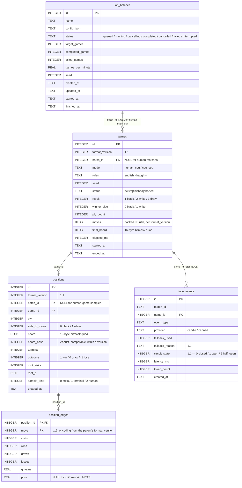

# 12. Database Schema



`position_edges` is `WITHOUT ROWID` with a composite primary key of `(position_id, move)`; the diagram shows both columns as the key. `positions` additionally carries a `UNIQUE (game_id, ply)` constraint that the ER notation cannot express.

The following is the MVP schema, with the 1.1 additions marked.

```sql
PRAGMA journal_mode = WAL;
PRAGMA synchronous  = NORMAL;
PRAGMA foreign_keys = ON;

CREATE TABLE IF NOT EXISTS lab_batches (
    id INTEGER PRIMARY KEY,
    name TEXT NOT NULL,
    config_json TEXT NOT NULL,
    status TEXT NOT NULL DEFAULT 'queued'
        CHECK (status IN ('queued', 'running', 'cancelling', 'completed',
                          'cancelled', 'failed', 'interrupted')),
    target_games INTEGER NOT NULL DEFAULT 0,
    completed_games INTEGER NOT NULL DEFAULT 0,
    failed_games INTEGER NOT NULL DEFAULT 0,
    games_per_minute REAL,
    seed INTEGER,
    created_at TEXT NOT NULL DEFAULT (datetime('now')),
    updated_at TEXT NOT NULL DEFAULT (datetime('now')),
    started_at TEXT,
    finished_at TEXT
);

CREATE TABLE IF NOT EXISTS games (
    id INTEGER PRIMARY KEY,

    -- 1.1: version of the BLOB encodings used by this row.
    -- Governs `moves` and `final_board`. See §13.7.
    format_version INTEGER NOT NULL DEFAULT 1,

    -- NULL for human matches, set for lab batches.
    batch_id INTEGER REFERENCES lab_batches(id) ON DELETE CASCADE,

    mode TEXT NOT NULL CHECK (mode IN ('human_cpu', 'cpu_cpu')),
    rules TEXT NOT NULL DEFAULT 'english_draughts',

    seed INTEGER NOT NULL,

    status TEXT NOT NULL DEFAULT 'active'
        CHECK (status IN ('active', 'finished', 'aborted')),

    -- 1 = black win, 2 = white win, 3 = draw, NULL if active.
    result INTEGER CHECK (result IN (1, 2, 3)),

    winner_side INTEGER CHECK (winner_side IN (0, 1)),

    ply_count INTEGER NOT NULL DEFAULT 0,

    -- Compact packed move history.
    -- Array of little-endian u16 move records. Encoding per format_version.
    moves BLOB NOT NULL DEFAULT x'',

    -- Optional final board snapshot.
    -- 16 bytes: black_men u32, white_men u32,
    --           black_kings u32, white_kings u32. Encoding per format_version.
    final_board BLOB,

    elapsed_ms INTEGER,

    started_at TEXT NOT NULL DEFAULT (datetime('now')),
    ended_at TEXT
);

CREATE INDEX IF NOT EXISTS idx_games_batch_status
    ON games (batch_id, status);

CREATE INDEX IF NOT EXISTS idx_games_result
    ON games (result)
    WHERE result IS NOT NULL;

CREATE TABLE IF NOT EXISTS positions (
    id INTEGER PRIMARY KEY,

    -- 1.1: version of the BLOB encoding used by this row.
    -- Governs `board`, and the semantics of `board_hash`. See §13.7.
    format_version INTEGER NOT NULL DEFAULT 1,

    -- Denormalized for efficient batch export/delete.
    -- NULL for positions sampled from a human match (sample_kind = 2),
    -- which belong to no batch. NOT NULL here would make `human_game_sample`
    -- unrepresentable; see §13.3 and the sample_kind encoding below.
    batch_id INTEGER REFERENCES lab_batches(id) ON DELETE CASCADE,

    game_id INTEGER NOT NULL REFERENCES games(id) ON DELETE CASCADE,

    ply INTEGER NOT NULL,

    -- 0 = black, 1 = white.
    side_to_move INTEGER NOT NULL CHECK (side_to_move IN (0, 1)),

    -- Compact board encoding.
    -- 16 bytes: black_men u32, white_men u32,
    --           black_kings u32, white_kings u32.
    board BLOB NOT NULL,

    -- Zobrist hash from the fixed key table. Comparable across rows only
    -- when format_version matches.
    board_hash INTEGER NOT NULL,

    -- 0 = non-terminal, 1 = terminal.
    terminal INTEGER NOT NULL DEFAULT 0 CHECK (terminal IN (0, 1)),

    -- Outcome from perspective of side_to_move.
    -- 1 = win, 0 = draw, -1 = loss.
    outcome INTEGER NOT NULL CHECK (outcome IN (-1, 0, 1)),

    -- Total visits at root MCTS node for this position.
    root_visits INTEGER NOT NULL DEFAULT 0,

    -- Average value from perspective of side_to_move.
    root_q REAL NOT NULL DEFAULT 0.0,

    -- 0 = mcts_sample, 1 = terminal_sample, 2 = human_game_sample.
    sample_kind INTEGER NOT NULL DEFAULT 0,

    created_at TEXT NOT NULL DEFAULT (datetime('now')),

    UNIQUE (game_id, ply)
);

CREATE INDEX IF NOT EXISTS idx_positions_batch
    ON positions (batch_id, sample_kind);

CREATE INDEX IF NOT EXISTS idx_positions_game_ply
    ON positions (game_id, ply);

CREATE INDEX IF NOT EXISTS idx_positions_board_hash
    ON positions (board_hash);

CREATE TABLE IF NOT EXISTS position_edges (
    position_id INTEGER NOT NULL REFERENCES positions(id) ON DELETE CASCADE,

    -- Compact move encoding as u16, stored as INTEGER for SQLite compatibility.
    -- Encoding is governed by the parent position's format_version; see §13.7.
    move INTEGER NOT NULL,

    -- Stats are from the perspective of the parent position's side_to_move.
    visits INTEGER NOT NULL DEFAULT 0,
    wins INTEGER NOT NULL DEFAULT 0,
    draws INTEGER NOT NULL DEFAULT 0,
    losses INTEGER NOT NULL DEFAULT 0,

    -- Average value from parent side_to_move perspective.
    q_value REAL NOT NULL DEFAULT 0.0,

    -- Optional prior probability.
    -- For random rollout MCTS this may be uniform or NULL.
    -- For future neural policy, this can store policy prior.
    prior REAL,

    PRIMARY KEY (position_id, move)
) WITHOUT ROWID;

CREATE TABLE IF NOT EXISTS face_events (
    id INTEGER PRIMARY KEY,
    match_id TEXT,
    game_id INTEGER REFERENCES games(id) ON DELETE SET NULL,
    event_type TEXT NOT NULL,

    -- 1.1: 'candle' | 'canned'. 'ollama' no longer produced.
    provider TEXT NOT NULL,

    fallback_used INTEGER NOT NULL DEFAULT 0 CHECK (fallback_used IN (0, 1)),

    -- 1.1: why the fallback was used, NULL when it was not.
    -- 'circuit_open' | 'timeout' | 'inference_error' | 'saturated'
    -- | 'model_not_loaded' | 'empty_output' | 'disabled' | 'rate_limited'
    fallback_reason TEXT,

    -- 1.1: breaker state at the time of the request.
    -- 0 = closed, 1 = open, 2 = half_open.
    circuit_state INTEGER NOT NULL DEFAULT 0 CHECK (circuit_state IN (0, 1, 2)),

    latency_ms INTEGER,
    token_count INTEGER,
    created_at TEXT NOT NULL DEFAULT (datetime('now'))
);

CREATE INDEX IF NOT EXISTS idx_face_events_created
    ON face_events (created_at);
```

## 12.1 Migration from a v1.0 Database

`format_version` is additive with a default, so an existing database upgrades without a rewrite. Existing rows were produced by the v1.0 encodings, which *are* version 1 — the default backfills correctly, and no data conversion is required.

```sql
-- `PRAGMA foreign_keys` is a no-op inside a transaction, so it is toggled
-- outside the BEGIN/COMMIT pair. Issuing it between BEGIN and COMMIT would
-- silently leave enforcement on and fail the DROP below.
PRAGMA foreign_keys = OFF;

BEGIN IMMEDIATE;

ALTER TABLE games     ADD COLUMN format_version INTEGER NOT NULL DEFAULT 1;
ALTER TABLE positions ADD COLUMN format_version INTEGER NOT NULL DEFAULT 1;

ALTER TABLE face_events ADD COLUMN fallback_reason TEXT;
ALTER TABLE face_events ADD COLUMN circuit_state INTEGER NOT NULL DEFAULT 0;

-- v1.0 rows may carry provider = 'ollama'. Left as historical fact;
-- new rows are only ever 'candle' or 'canned'.

-- 'cancelling' and 'interrupted' are new lab_batches statuses. SQLite
-- cannot alter a CHECK constraint in place, so this is the one table
-- that needs a rebuild.
CREATE TABLE lab_batches_new ( /* ... schema as above ... */ );
INSERT INTO lab_batches_new SELECT * FROM lab_batches;
DROP TABLE lab_batches;
ALTER TABLE lab_batches_new RENAME TO lab_batches;

COMMIT;

PRAGMA foreign_keys = ON;
PRAGMA foreign_key_check;   -- must return no rows before the process serves traffic
```

Migrations run at startup, before the writer actor accepts its first message, on the writer connection, inside a single transaction.

---

← [11. Database Architecture](11-database-architecture.md) · **[Index](README.md)** · [13. Data Dictionary](13-data-dictionary.md) →
