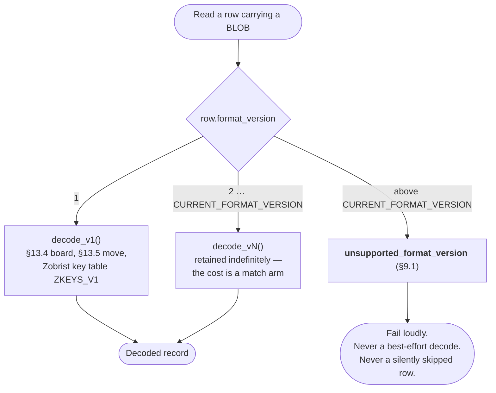

# 13. Data Dictionary

## 13.1 Side Encoding

| Value | Meaning |
|---:|---|
| 0 | Black |
| 1 | White |

Black moves first.

---

## 13.2 Game Result Encoding

| Value | Meaning |
|---:|---|
| 1 | Black win |
| 2 | White win |
| 3 | Draw |
| NULL | Active or unknown |

---

## 13.3 Position Outcome Encoding

Stored from the perspective of `positions.side_to_move`.

| Value | Meaning |
|---:|---|
| 1 | Side to move eventually wins |
| 0 | Draw |
| -1 | Side to move eventually loses |

---

## 13.4 Board BLOB Encoding — format_version 1

16 bytes, little-endian:

| Offset | Size | Field |
|---:|---:|---|
| 0 | 4 | `black_men` bitmask |
| 4 | 4 | `white_men` bitmask |
| 8 | 4 | `black_kings` bitmask |
| 12 | 4 | `white_kings` bitmask |

The board uses the 32 playable dark squares represented as bits 0 through 31.

---

## 13.5 Move Encoding — format_version 1

Each move is stored as a 16-bit unsigned integer in little-endian form.

Bit layout:

| Bits | Field | Meaning |
|---:|---|---|
| 0-4 | `from` | Source square, 0-31 |
| 5-9 | `to` | Destination square, 0-31 |
| 10 | `capture` | Capture step |
| 11 | `promotion` | Promotion occurred |
| 12 | `continuation` | Another jump follows in same turn |
| 13-15 | reserved | Reserved for future use; must be written as 0 and must be ignored on read |

Multi-jump moves are stored as a sequence of step moves.

Example:

```text
black multi-jump: [move1, move2, move3]
```

`continuation` is set for all but the final jump.

---

## 13.6 `games.moves` BLOB — format_version 1

`games.moves` is a packed array of u16 move records.

```text
[move_0][move_1][move_2]...
```

Each record is two bytes little-endian.

For a 40-move game:

```text
40 moves * 2 bytes = 80 bytes
```

One million games at 80 bytes average is approximately:

```text
80 MB of move history
```

At 1.1 lab throughput, 100M games is a realistic multi-month figure, which is roughly 8 GB of move history — still trivial. Positions and edges dominate storage, which is why they are sampled.

---

## 13.7 `format_version` — New in 1.1

The board and move BLOBs are deliberately compact, undelimited, and self-describing in no way whatsoever. That is the right trade for volume, and it is exactly why a version tag is mandatory: a 16-byte BLOB with no header cannot be distinguished from a differently-encoded 16-byte BLOB after the fact. Without this column, any future change to bit layout, square numbering, or the Zobrist key table would silently corrupt every historical row's interpretation.

Every read dispatches on the version before it touches a byte of the BLOB:



**Version registry:**

| Version | Introduced | `games.moves` | `games.final_board` / `positions.board` | `positions.board_hash` |
|---:|---|---|---|---|
| 1 | v1.0 (retroactively named in v1.1) | Packed LE u16, layout [§13.5](#135-move-encoding--format_version-1) | 16-byte LE bitmask quad, [§13.4](#134-board-blob-encoding--format_version-1) | Zobrist over key table `ZKEYS_V1` |

**Rules:**

1. `format_version` is written by the producer at insert time from a single compile-time constant, `CURRENT_FORMAT_VERSION`. It is never defaulted by application code and never inferred.
2. A reader **must** dispatch on `format_version` before interpreting any BLOB. Reading a BLOB without checking the version is a review-blocking defect.
3. A reader encountering a version greater than `CURRENT_FORMAT_VERSION` must fail with `unsupported_format_version` ([§9.1](09-api-contract.md#91-error-model)). It must not attempt a best-effort decode, and it must not skip the row silently — a training export that quietly drops 12% of its rows is worse than one that refuses to run.
4. Decoders for older versions are retained indefinitely. The cost is a `match` arm; the alternative is unreadable historical data.
5. `position_edges` has no column of its own. Its `move` encoding is governed by its parent `positions.format_version`, reached through the mandatory join. This is deliberate: an edge is meaningless without its position, so a version that could disagree with the parent's would be a bug surface rather than a feature.
6. **A change to the Zobrist key table is a format version bump**, even though the bit layout is unchanged. `positions.board_hash` is persisted and joined on; keys that differ between builds would make two encodings of the same position look like different positions, and vice versa.
7. `board_hash` is a `u64` Zobrist value stored in a SQLite `INTEGER`, which is a signed 64-bit column. The value is written and read as a bit-preserving reinterpretation, not a numeric conversion: roughly half of all hashes appear as negative integers in the database, and that is correct. Equality and `GROUP BY` are unaffected; ordering by `board_hash` is meaningless and must not be relied on.

**What warrants a bump:** any change to bit layout, field widths, square numbering, endianness, the meaning of reserved bits, or the Zobrist key table. **What does not:** adding a column, adding an index, changing sampling policy, or changing the evaluator.

---

← [12. Database Schema](12-database-schema.md) · **[Index](README.md)** · [14. Training Lab Sampling Strategy](14-sampling-strategy.md) →
