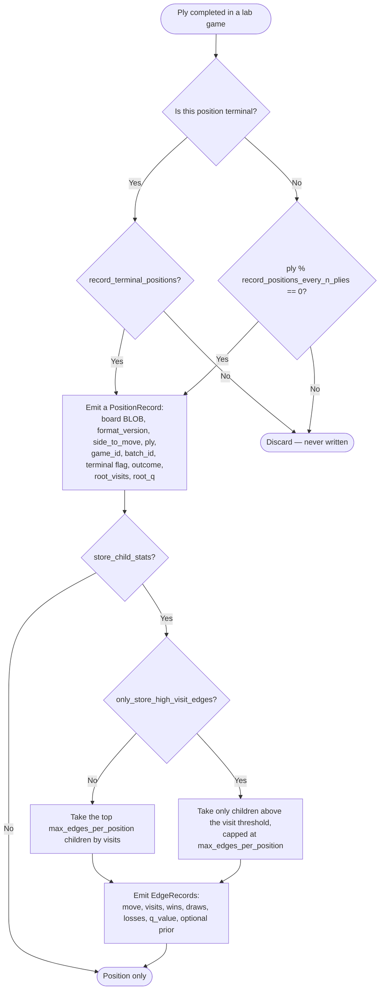

# 14. Training Lab Sampling Strategy

Storing every MCTS node for millions of games is unrealistic at any host size. Sampling is mandatory — but 1.1 raised the defaults, because the binding constraint moved from "can we write this fast enough" to "is this data worth its disk", and 1.4 does not move it back. Halving RAM changes what is cached, not what is written: the sampled row for a position is the same row on a 64 GB host as on a 128 GB one, and the disk it lands on is unchanged.

---

## 14.1 Sampling Options

```json
{
  "record_positions_every_n_plies": 2,
  "record_terminal_positions": true,
  "max_edges_per_position": 16,
  "store_child_stats": true,
  "only_store_high_visit_edges": false
}
```

---

## 14.2 Recommended Defaults

**Default profile** — roughly 2× the v1.0 density, unchanged by the 1.4 re-baseline:

```json
{
  "record_positions_every_n_plies": 2,
  "record_terminal_positions": true,
  "max_edges_per_position": 16,
  "store_child_stats": true,
  "only_store_high_visit_edges": false
}
```

**High-density profile**, for a batch specifically intended as neural-network training data:

```json
{
  "record_positions_every_n_plies": 1,
  "record_terminal_positions": true,
  "max_edges_per_position": 32,
  "store_child_stats": true,
  "only_store_high_visit_edges": false
}
```

**Constrained profile**, retained for smaller hosts and long-running exploratory batches:

```json
{
  "record_positions_every_n_plies": 4,
  "record_terminal_positions": true,
  "max_edges_per_position": 8,
  "store_child_stats": true,
  "only_store_high_visit_edges": true
}
```

Rough storage arithmetic for the default profile, to make the trade concrete:

```text
Average game: ~50 plies -> ~25 sampled positions
Position row: ~64 bytes + index overhead   -> ~110 bytes effective
Edges: 16 per position * ~40 bytes         -> ~640 bytes
Per game: ~25 * (110 + 640)                -> ~18 KB
1,000,000 games                            -> ~18 GB
```

18 GB per million games is comfortable. 100M games would be ~1.8 TB, which is a disk-provisioning decision rather than an architectural one, and is the point at which batch-level pruning ([§16.5](16-memory-strategy.md#165-storage-controls)) becomes routine rather than optional.

At the 1.4 throughput target of 600–1 200 games/minute ([Appendix B](appendix-b-performance-targets.md)), a million games is roughly 14–28 hours of continuous lab time, and at ~18 KB/game that same throughput writes roughly 15.6–31.1 GB per day of continuous running. Provision disk against the top of that range, not the per-million-games figure — disk, not RAM, is what a long campaign consumes.

---

The per-ply decision, in the order it is evaluated:



## 14.3 What Gets Stored

For each sampled position:

- Board BLOB.
- `format_version`.
- Side to move.
- Ply.
- Game ID.
- Batch ID.
- Terminal flag.
- Final outcome from side-to-move perspective.
- Root visit count.
- Root Q value.

For each selected edge:

- Move.
- Visits.
- Wins.
- Draws.
- Losses.
- Q value.
- Optional prior.

This provides enough information for future:

- Value model training.
- Policy distillation.
- Sequence mining.
- Opening discovery.
- Endgame analysis.

One caveat that 1.1 must state plainly: in `Throughput` transposition mode, a sampled `root_q` may incorporate rollout statistics accumulated from *other games in the same batch*. That is a feature for search strength and a subtlety for training — the samples are no longer independent. A batch intended for careful statistical work should set `"reproducible": true`, which forces `Deterministic` mode and restores per-game independence at some cost in throughput. The flag is recorded in `lab_batches.config_json`, so this property of a dataset is always recoverable.

---

← [13. Data Dictionary](13-data-dictionary.md) · **[Index](README.md)** · [15. Concurrency Model](15-concurrency-model.md) →
