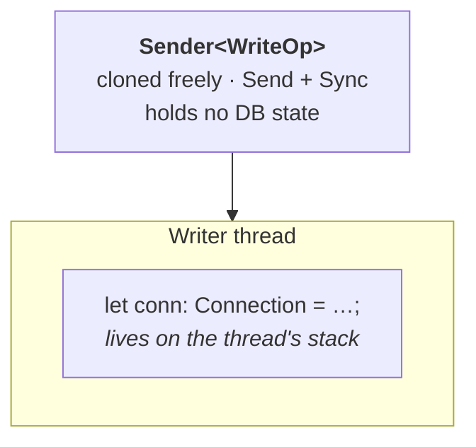
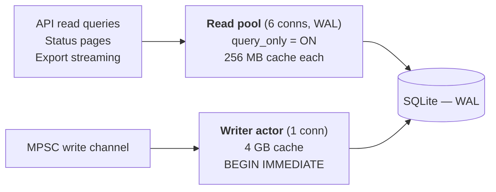
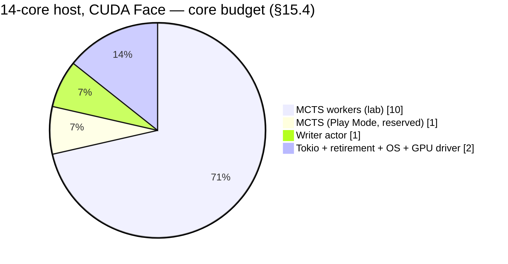

# 15. Concurrency Model

The process runs four distinct kinds of thread, and the architecture keeps them separate on purpose. Mixing them is how a slow taunt becomes a slow move, and how a big commit becomes a stalled HTTP handler.

| Pool | Threads | Work | Blocking allowed |
|---|---|---|---|
| Tokio runtime | `min(physical_cores, 4)` | HTTP, routing, templating | Never |
| MCTS worker pool | `physical_cores - 4` ([§15.4](#154-cpu-partitioning)) | Search, evaluation, transposition probes | Yes (CPU-bound) |
| Inference pool | 1 | Candle token generation — a submitting thread on CUDA, a working thread on CPU | Yes |
| Writer actor | 1 | SQLite writes | Yes (that is its job) |

On the 14-core target host that is 10 MCTS workers, 4 Tokio threads, 1 inference thread and 1 writer. [§15.4](#154-cpu-partitioning) is the authority for those numbers and explains why the count did not fall as far as the core count did.

---

## 15.1 HTTP and Engine Separation

The HTTP server must not block on CPU-heavy MCTS work.

```rust
let result = tokio::task::spawn_blocking(move || {
    engine.search(&state)
}).await?;
```

For lab work:

- Use a bounded worker pool sized to physical cores, leaving headroom for the writer and inference threads.
- Prefer deterministic iteration budgets.
- Never let a lab batch consume every core: Play Mode must stay responsive while a batch runs, and the reservation in [§15.4](#154-cpu-partitioning) is what guarantees it.

---

## 15.2 The Write Path — MPSC Actor Detail

### 15.2.1 Channel

```rust
// crossbeam-channel: producers are synchronous OS threads, not async tasks,
// so a sync channel avoids dragging the Tokio runtime into the lab pipeline.
let (tx, rx) = crossbeam_channel::bounded::<WriteOp>(cfg.channel_capacity);
```

| Property | Value | Rationale |
|---|---|---|
| Capacity | 262 144 messages (default) | Absorbs a multi-minute burst from 10 workers without blocking |
| Message granularity | One message per finished game's positions, not per row | Keeps the message count proportional to games |
| Memory ceiling | ~2 GB ([§16.1](16-memory-strategy.md#161-memory-budget)) | `channel_capacity × average message size`, validated at startup against the configured budget |
| Full behavior | Per-producer, see [§11.2.5](11-database-architecture.md#1125-backpressure) | Lab blocks, durable writes fail fast, telemetry drops |

The capacity is validated, not assumed: at startup the configured `channel_capacity` is multiplied by a measured average message size and rejected if it exceeds the write-buffer budget. A configuration that could OOM the process should fail at boot, not at hour six of a batch.

### 15.2.2 Ownership



The write `Connection` is never wrapped in an `Arc<Mutex<_>>` and never handed to anything. It is a local variable on one thread. Concurrent access is not merely discouraged — there is no value in the program through which it could be attempted.

### 15.2.3 Identifier Allocation

Because `position_edges` rows are constructed before their parent `positions` rows are inserted ([§11.2.4](11-database-architecture.md#1124-the-transaction)), primary keys must be known in advance.

```rust
pub struct IdAllocator {
    next_game: AtomicI64,
    next_position: AtomicI64,
}

pub struct IdLease {
    pub games: Range<i64>,
    pub positions: Range<i64>,
}

impl IdAllocator {
    /// Seeded at startup from MAX(id) of each table.
    pub fn resume_from(conn: &Connection) -> Result<Self, DbError> { /* ... */ }

    /// A worker takes a lease and assigns ids locally, with no coordination.
    pub fn lease(&self, games: i64, positions: i64) -> IdLease { /* ... */ }
}
```

Consequences, all of which are acceptable and should be documented rather than discovered:

- Ids are monotonic but not gapless. A cancelled batch or a dropped lease leaves holes. Nothing depends on density.
- A crash loses the unused portion of outstanding leases; recovery reseeds from `MAX(id)` and continues.
- Ids remain assignable without a round trip to SQLite, which is the entire point.

---

## 15.3 SQLite Concurrency



Rules:

- Exactly one write connection, owned by one thread.
- Many read connections under WAL; readers never block the writer and the writer never blocks readers.
- Writes are batched to 50k+ rows.
- Long-running read transactions are avoided, because they pin the WAL and prevent checkpointing. Export queries use keyset pagination (`WHERE id > ? ORDER BY id LIMIT ?`), not a single open cursor over hundreds of millions of rows.
- Checkpoints are scheduled by the writer ([§11.1](11-database-architecture.md#111-sqlite-runtime-configuration)), never by SQLite's autocheckpoint.

---

## 15.4 CPU Partitioning

CPU is a contended resource between greedy consumers, and 1.4 changes both the size of the pie and the number of people at the table. The target host has **14 physical cores / 28 threads** ([§2.4](02-scope-and-constraints.md#24-hardware-baseline)), not the 16+ assumed through 1.3 — but moving inference to the GPU ([§7.4.1](07-face-llm-layer.md#741-device-selection)) hands back the cores that partition was holding in reserve.

**Default partition — 14 physical cores, `face.device = "cuda"`:**

| Consumer | Cores | Notes |
|---|---:|---|
| MCTS workers (lab) | 10 | Configurable; the batch's `worker_threads` |
| MCTS (Play Mode) | 1 | Reserved, so an interactive search is never starved by a batch |
| Candle inference | ~0 | On CUDA the inference thread submits kernels and waits. It needs a thread, not a core |
| Writer actor | 1 | I/O-bound; blocks on `fsync` and page-cache writeback more than it computes |
| Tokio + retirement + OS + GPU driver | 2 | HTTP is trivial here; the driver's own threads are real and are budgeted |



**Fallback partition — the same host with `face.device` resolving to CPU:**

| Consumer | Cores | Notes |
|---|---:|---|
| MCTS workers (lab) | 8 | **Two fewer.** This is the cost of the CPU inference path, and it is why [§7.5.3](07-face-llm-layer.md#753-the-cpu-ladder--the-fallback-profile) also drops the model |
| MCTS (Play Mode) | 1 | Unchanged; the reservation is what makes Play Mode responsive under load |
| Candle inference | 2 | Hard cap. Candle will happily use every core it is given |
| Writer + Tokio + retirement + OS | 3 | |

The inference cap is the important line whenever it applies, and it is the constraint [§7.5](07-face-llm-layer.md#75-model-selection-and-memory-budget) is derived from. Left unconfigured, a quantized model generating 64 tokens saturates every core it can reach, and the resulting *move* latency — not the taunt latency — is what a player notices. This is the contention the external Ollama process made invisible in v1.0, that moving in-process made visible and controllable, and that moving to CUDA now largely removes.

`candle_core` respects `RAYON_NUM_THREADS`; the runtime sets its own thread-pool size explicitly at construction rather than relying on an environment variable being present. On CUDA the setting is inert but should still be applied, because the process may fall back to CPU at any boot.

### 15.4.1 Why Not 28 Workers

The host reports 28 logical CPUs. The lab worker pool is sized to **physical** cores, and running one worker per hardware thread is the wrong default here for three reasons:

1. **The workload is memory-bound, not compute-bound.** MCTS on a 24 GB transposition table is a stream of dependent DRAM round trips ([§6.7.1](06-mcts-extensibility.md#671-rationale)). Hyperthread siblings share one core's load/store path and one L2, so the second thread waits on the same memory the first is already waiting on. Two populated memory channels ([§2.4](02-scope-and-constraints.md#24-hardware-baseline)) make this sharply worse, not marginally.
2. **Per-worker arenas are real memory.** Each worker holds a search arena ([§16.1](16-memory-strategy.md#161-memory-budget)). Doubling workers doubles that row, on a host that just lost half its RAM.
3. **The reservations stop working.** Play Mode's reserved core is only reserved if something is not already using it.

None of that makes SMT worthless — it is typically worth 10–20 % on this kind of workload — so `worker_threads` remains configurable and [§20.9](20-testing-strategy.md#209-performance-regression-baselines) measures 8, 10, 14 and 20 rather than asserting one. The **default** is 10, and a build that finds 20 meaningfully faster should change the default and record the measurement, not the assumption.

### 15.4.2 The GPU Is Not in This Table

Only the Face layer touches the device, and it does so from one thread ([§7.4](07-face-llm-layer.md#74-candle-inference-runtime--replaces-the-ollama-rest-adapter)). The engine, the rules core, the transposition table and the writer are CPU-only and stay that way for the whole MVP — [§19.6.6](19-extensibility-roadmap.md#1966-what-cuda-is-not-for--new-in-14) says why trying to change that is a bad trade. The GPU's cost to this partition is the driver's own host threads, which is why they are budgeted explicitly above rather than assumed free.

---

## 15.5 Background Jobs

| Job | Purpose | Cadence |
|---|---|---|
| Lab runner | Executes CPU vs. CPU batches | While a batch is active |
| DB writer actor | Drains the channel, commits batches, checkpoints | Continuous |
| TT retirement thread | Epoch-based eviction from the transposition table | On overflow signal |
| Commentary generator | Produces taunts off the move critical path | Per commentary event |
| Circuit breaker probe | Half-open trial after cooldown | Every 5 min while open |
| Cleanup worker | Optional old batch pruning, `PRAGMA optimize` | Nightly |

All are cancellable through cooperative cancellation tokens. The writer actor is the exception to "cancel immediately": it must always drain before it stops ([§9.11](09-api-contract.md#911-cancel-lab-batch)).

---

← [14. Training Lab Sampling Strategy](14-sampling-strategy.md) · **[Index](README.md)** · [16. Hardware and Memory Strategy](16-memory-strategy.md) →
