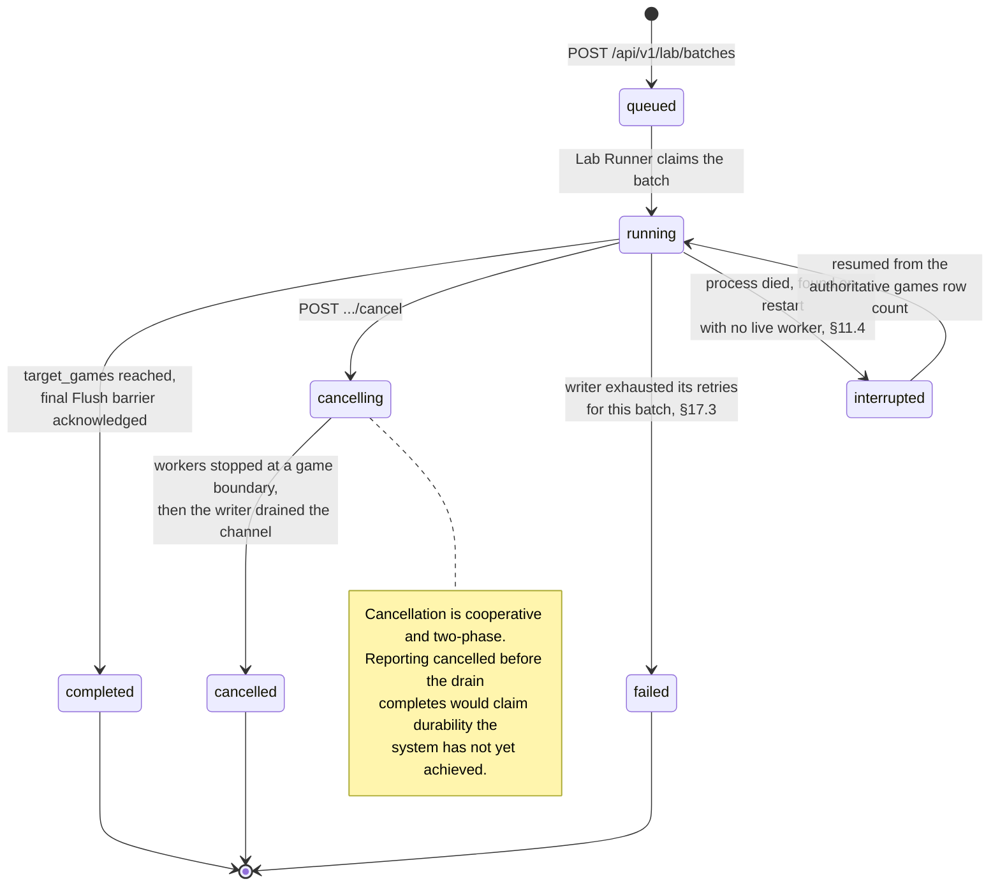

# 17. Reliability and Failure Handling

## 17.1 Engine Failures

If MCTS fails:

- Return a clear error for human matches.
- Mark the lab game as failed and increment `failed_games`.
- Continue the batch if possible.
- Record the failure count.

Engine failure must not corrupt persisted game state.

**Transposition table failures are not a category.** The table is a cache: a probe that returns garbage is caught by the board verification in [§6.7.3](06-mcts-extensibility.md#673-probe-and-store); a table that is full stops storing; a table that is disabled makes the engine slower and nothing else. If a bug in the table can produce an incorrect *move*, the design has been violated, and [§20.5](20-testing-strategy.md#205-transposition-table-tests)'s differential test exists to detect exactly that.

---

## 17.2 Face Failures

If inference fails:

- Use fallback commentary.
- Do not fail move handling.
- Record latency, provider, `fallback_reason`, and `circuit_state` in `face_events`.
- **Report the failure to the circuit breaker and do not retry.**

After 3 consecutive qualifying failures ([§7.8.3](07-face-llm-layer.md#783-what-counts-as-a-failure)) the circuit opens for 5 minutes. During that window there is no inference at all: commentary costs one atomic load and a canned line. The system settles into a degraded-but-fast steady state instead of paying the deadline repeatedly.

A tripped circuit is logged once on transition, with the failure that caused it — not once per short-circuited request. An operator should see one line saying the model went away, not ten thousand.

Startup is a special case. If the model file is missing, fails to load, or will not fit in VRAM ([§16.6](16-memory-strategy.md#166-vram-budget--new-in-14)), the breaker starts `Open` with an infinite cooldown and the service runs on canned lines indefinitely. **The process still starts and serves games.** A missing `.gguf` is a configuration problem, not an outage, and refusing to boot over it would convert an optional feature into a hard dependency — which is exactly what [§2.3](02-scope-and-constraints.md#23-explicit-constraint-llm-does-not-play-draughts) exists to prevent.

---

## 17.3 Database Failures

If a write transaction fails:

- Retry with bounded exponential backoff. `SQLITE_BUSY` and `SQLITE_LOCKED` are retryable; constraint violations are not, and are a bug to be surfaced immediately rather than retried.
- **Preserve the in-memory buffer across retries.** The batch is not discarded until it either commits or exhausts its retries.
- On exhaustion, mark the affected lab batches `failed`, drop the buffer, log the full error, and continue draining. One poisoned batch must not stop the writer.
- Signal `Err` on any pending `Flush` acks so durable-class callers learn about it, rather than waiting forever.
- If the failure is at the connection level — disk full, database corrupt, read-only filesystem — the writer transitions the whole persistence layer to `degraded`: durable writes return `503`, bulk writes are dropped with a counter, `/health` reports `status: "degraded"` with `writer.last_error` populated, and the read pool keeps serving. **A full disk should make the system read-only, not dead.**

Crash semantics are stated in [§11.4](11-database-architecture.md#114-durability-classes--new-in-11) and are worth repeating because they are the price of the RAM buffer: an abrupt process death loses up to `channel_capacity` buffered messages plus one in-flight transaction of bulk-class data. Durable-class data that was acknowledged is not lost. WAL mode guarantees the file itself is never corrupt, only that recent bulk transactions may be absent.

---

## 17.4 Backpressure and Saturation

Saturation is a normal operating condition at 1.1 throughput, not an error. Each subsystem has one defined behavior, and none of them is "grow without bound":

| Subsystem | Saturation signal | Response |
|---|---|---|
| Write channel | `queue_depth` approaching capacity | Lab workers block; durable writes 503; telemetry drops |
| Transposition table | `entries` at capacity | Epoch retirement; hit rate degrades gracefully |
| Inference queue | `queue_depth >= max_queue_depth` | `FaceError::Saturated`, immediate canned fallback, **not** a breaker failure |
| VRAM | Allocation refused by the CUDA allocator | `FaceError::Inference` and a breaker failure; the game is unaffected ([§16.6](16-memory-strategy.md#166-vram-budget--new-in-14)) |
| MCTS pool | All workers busy | Play Mode uses its reserved core; lab work queues |

---

## 17.5 Process-Level Risk from In-Process Inference

Moving the model into the address space removes a process boundary that was also a blast-radius boundary. This is the one genuine regression in 1.1 and it should be recorded as such.

| Risk | Mitigation |
|---|---|
| A panic in the inference path unwinds into a worker | The inference thread runs the generation body inside `catch_unwind`; a panic becomes `FaceError::Inference` and a breaker failure |
| An abort (OOM in a Candle allocation, an FFI-level fault) kills the process | Bounded by the 2 GB host budget ([§16.1](16-memory-strategy.md#161-memory-budget)), the 4.5 GB VRAM cap ([§16.6](16-memory-strategy.md#166-vram-budget--new-in-14)) and a fixed KV-cache size; `max_tokens` and `max_queue_depth` cap the largest allocation the runtime can attempt on either device. This risk is reduced, not eliminated |
| **A CUDA fault takes the process down — new in 1.4** | A device-side fault (an Xid, a driver reset, a display driver crash while the desktop shares the card) is not catchable by `catch_unwind`: the CUDA context is poisoned and every subsequent call fails. This is a **wider** blast radius than the CPU path, and it is the price of the GPU. Mitigation: the device is touched by exactly one thread in one component, and the CPU profile is a complete, tested path to fall back to on restart ([§7.4.1](07-face-llm-layer.md#741-device-selection)). A deployment that cannot tolerate the risk sets `face.device = "cpu"` and loses ~2 lab workers and some commentary quality |
| A CUDA OOM at load, or mid-generation | **Not** a process failure. At load it is `ModelNotLoaded` and a permanently open breaker; mid-generation it is `FaceError::Inference` and a breaker failure. The game is untouched either way ([§16.6](16-memory-strategy.md#166-vram-budget--new-in-14) rule 2) |
| Model file corrupt or truncated | Validated at load; failure leaves the breaker permanently open ([§17.2](#172-face-failures)), the service still runs |
| Weight loading competes with a running lab batch | `warm_on_start` performs the load before the HTTP listener binds and before any batch can be started |

The honest summary: v1.0 could lose commentary without touching the game. v1.1 can, in a narrow class of failures, lose the process, and **1.4 widens that class slightly by adding a GPU driver to it**. The mitigation is a hard memory budget on both devices, a hard token budget, a single-threaded inference path, `catch_unwind`, and a fully tested CPU fallback — and the acceptance is that a single-binary deployment is worth that residual risk on a single-machine MVP. An operator who disagrees has a one-key answer (`face.device = "cpu"`) rather than a redesign, which is the point of keeping both paths real.

---

## 17.6 Cancellation

Lab batches must support cancellation. Cancellation is cooperative and two-phase:

1. **`cancelling`** — workers observe the token between games, finish or abort the current game at a safe boundary, and stop producing.
2. **Drain** — a `Flush` barrier is enqueued; the writer commits everything already in the channel.
3. **`cancelled`** — set only after the barrier is acknowledged.

Reporting `cancelled` before the drain completes would claim durability the system has not yet achieved. The intermediate status exists so the UI can say "finishing writes" rather than lying.

The complete `lab_batches.status` lifecycle, including the two statuses 1.1 added:

---

← [16. Hardware and Memory Strategy](16-memory-strategy.md) · **[Index](README.md)** · [18. Security and Safety](18-security-and-safety.md) →
