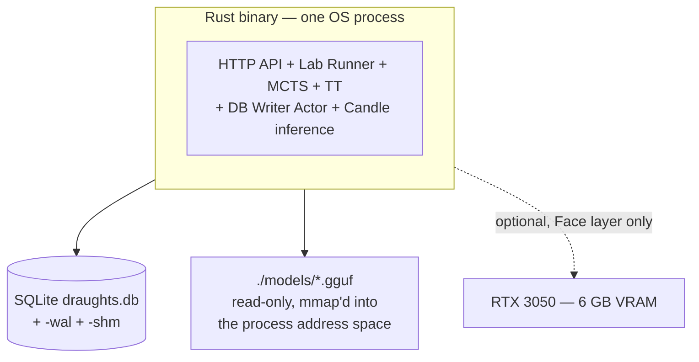
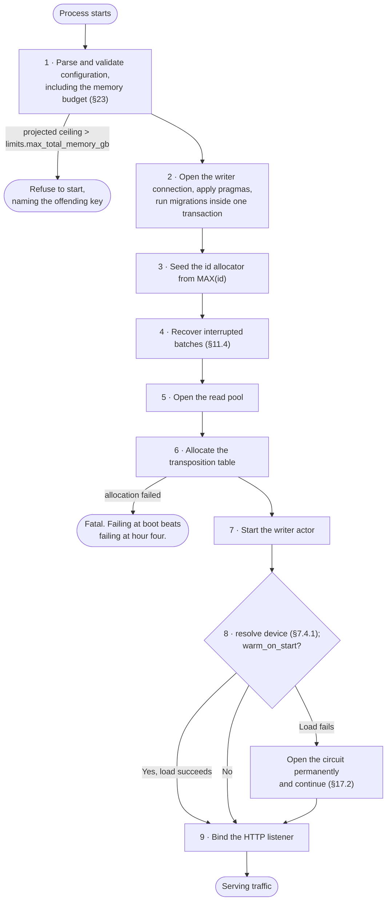
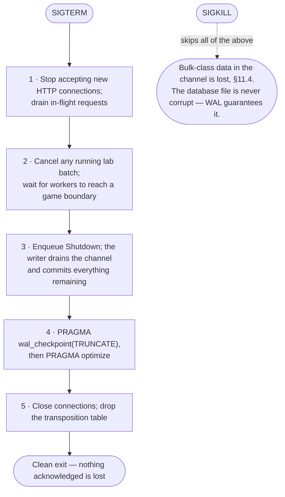

# 22. Deployment Model

## 22.1 MVP Single-Machine Deployment

Components:

- **One Rust binary** serving the HTTP API, the lab runner, the MCTS engine, the transposition table, the database writer, and LLM inference.
- Static assets served from the binary or the local filesystem.
- SQLite database file.
- **One or two quantized `.gguf` model files** — one per device profile ([§7.5.4](07-face-llm-layer.md#754-two-profiles-not-one-model-path)) — memory-mapped at startup, and copied to VRAM when the resolved device is CUDA.

The Ollama process is gone.



On-disk layout:

```text
draughts/
├── draughts                                    # the executable
├── draughts.toml                               # configuration
├── data/
│   ├── draughts.db
│   ├── draughts.db-wal
│   └── draughts.db-shm
└── models/
    ├── qwen2.5-1.5b-instruct-q4_k_m.gguf       # ~1.0 GB, CUDA profile
    ├── qwen2.5-1.5b-instruct/tokenizer.json
    ├── qwen2.5-0.5b-instruct-q4_k_m.gguf       # ~0.4 GB, CPU fallback profile
    └── qwen2.5-0.5b-instruct/tokenizer.json
```

Both profile models ship because the device can change between one boot and the next without anyone editing configuration; [§7.5.4](07-face-llm-layer.md#754-two-profiles-not-one-model-path) explains why one `model_path` is a silent-outage hazard. Together they are ~1.4 GB.

```bash
# Portable build: no CUDA dependency, runs on a machine with no driver.
just build-release

# Target-host build: adds the CUDA path. Ampere GA10x is compute capability 8.6.
CUDA_COMPUTE_CAP=86 just build-cuda

./target/release/draughts --config draughts.toml
```

**Both builds must work, and CI builds both** ([§20.10](20-testing-strategy.md#2010-device-parity-and-cuda-tests)). The `cuda` feature adds a device, never a requirement: the feature-enabled binary still starts, still plays, and still comments on a machine with no GPU, by falling back to the CPU profile ([§7.4.1](07-face-llm-layer.md#741-device-selection)).

A note on the toolkit, because it will come up on this host: driver 595.84 exposes CUDA 13.2, and by CUDA's *backward*-compatibility guarantee — a newer driver runs binaries built against an older toolkit — it runs binaries built against the 12.x line, which is what CI and `just build-cuda` actually target (toolkit 12.6.0; see `cuda-compile` in `ci.yml`). If `cudarc`'s supported toolkit range lags 13.x, install a 12.x toolkit alongside and point the build at it — that is the fix, not a driver downgrade. A mismatch surfaces as a link error at build time, which is the failure mode to prefer.

That is the entire deployment. No daemon to install, start, version-match, or health-check. No second port. No inter-process protocol to keep compatible across upgrades.

The `.gguf` is not embedded in the executable — a 6 GB binary would be hostile to every build, deploy, and CI system it touched. "Single binary" means one process and one deployable unit of *code*, not one file on disk.

---

## 22.2 Optional Process Separation

v1.0 noted that the architecture supports splitting the API and the lab runner into separate processes, because the engine is a library, persistence is isolated, the lab runner is headless, and the API does not depend on lab execution for core gameplay. **All four of those statements remain true, and the split is still possible — but 1.1 has made it materially more expensive, and that cost should be understood before anyone reaches for it.**

Three of this revision's components are process-global singletons:

| Component | Cost of splitting |
|---|---|
| Transposition table ([§6.7](06-mcts-extensibility.md#67-global-transposition-table--new-in-11)) | It is process memory. Two processes means two tables — halved hit rate and doubled memory — or a shared-memory design that does not exist and is not in scope |
| DB writer actor ([§11.2](11-database-architecture.md#112-write-strategy--mpsc-actor-pattern)) | It owns the only write connection. Two writing processes reintroduces SQLite write contention at the file level: exactly the bottleneck the actor was built to remove. The lab process would have to submit writes to the API process over IPC, which is the MPSC channel with a serialization boundary bolted on |
| Candle runtime ([§7.4](07-face-llm-layer.md#74-candle-inference-runtime--replaces-the-ollama-rest-adapter)) | Present in only one process, or loaded twice — and on CUDA a second process means a second CUDA context and a second copy of the weights in **5 GB of usable VRAM** ([§16.6](16-memory-strategy.md#166-vram-budget--new-in-14)), which does not fit |

The recommendation is therefore explicit: **do not split the API and the lab runner.** On this machine there is no resource argument for it, and the coupling it would break is coupling that 1.1 deliberately introduced in exchange for throughput. At 64 GB the argument is stronger than it was at 128: a second process means a second transposition table, and there is not 24 spare gigabytes to give it one.

If isolation is ever genuinely required, the split that makes sense is a different one. [§17.5](17-reliability.md#175-process-level-risk-from-in-process-inference) records the one real regression in this revision — an abort inside the inference path can take the whole process down. The isolation that would fix *that* is moving inference back out into its own process, which is to say reintroducing something Ollama-shaped. That trade should be made deliberately, on the evidence of an abort actually occurring, and understood for what it is: a reversal of shift 4, buying back a failure boundary at the cost of the single-binary deployment. It is not the default, and it is not what [§22.2](#222-optional-process-separation) was originally describing.

---

## 22.3 Startup Sequence

Order is chosen so that failures happen before the system accepts traffic:

1. Parse and validate configuration, including the memory budget ([§23](23-configuration-example.md)).
2. Open the writer connection, apply pragmas, run migrations inside one transaction.
3. Seed the id allocator from `MAX(id)`.
4. Recover interrupted batches ([§11.4](11-database-architecture.md#114-durability-classes--new-in-11)).
5. Open the read pool.
6. Allocate the transposition table. A failure here is fatal — the allocation is large and predictable, and failing at boot beats failing at hour four.
7. Start the writer actor.
8. Resolve the inference device ([§7.4.1](07-face-llm-layer.md#741-device-selection)) and load the matching profile's model if `warm_on_start`; on failure — including a CUDA OOM — open the circuit permanently and continue ([§17.2](17-reliability.md#172-face-failures)).
9. Bind the HTTP listener.



---

## 22.4 Shutdown Sequence

1. Stop accepting new HTTP connections; drain in-flight requests.
2. Cancel any running lab batch; wait for workers to reach a game boundary.
3. Enqueue `Shutdown`; the writer drains the channel and commits everything remaining.
4. `PRAGMA wal_checkpoint(TRUNCATE)`, then `PRAGMA optimize`.
5. Close connections; drop the transposition table.

A `SIGKILL` skips all of this, and [§11.4](11-database-architecture.md#114-durability-classes--new-in-11) defines exactly what is lost. A `SIGTERM` must not.



---

## 22.5 Operational Playbook

| Symptom | First check | Likely cause | Action |
|---|---|---|---|
| No commentary, games fine | `/health` → `face.circuit` | Model timing out under lab load | Expected. Reduce `worker_threads` or raise `deadline_ms` |
| Commentary suddenly ~3× slower, still working | `/health` → `face.device` | Device fell back to CPU: driver update, card busy, or a non-`cuda` binary deployed | Check `device_requested` vs `device`. The CPU profile is doing its job; fix the driver or accept the smaller model ([§7.4.1](07-face-llm-layer.md#741-device-selection)) |
| Commentary canned since boot, model file present | `/health` → `face.vram_used_mb` | CUDA OOM at load — the desktop session's share left too little ([§16.6](16-memory-strategy.md#166-vram-budget--new-in-14)) | Shrink the `cuda_profile` model, or set `device = "cpu"` |
| Lab throughput ~20 % below target, hit rate healthy | Huge pages on the table allocation | THP disabled; the probe path is TLB-bound | Enable THP or `MADV_HUGEPAGE` ([§16.3.1](16-memory-strategy.md#1631-bandwidth-not-just-capacity--new-in-14)) |
| Commentary canned since boot | `face.model_loaded` | Missing or corrupt `.gguf` | Fix `model_path`; restart |
| Lab throughput collapses, queue full | `writer.queue_high_water` | Writer is the bottleneck | Raise `db_batch_rows`; check index count |
| Lab throughput collapses, queue empty | `transposition_table.hit_rate` | Table thrashing at capacity | Raise `capacity_entries` or reduce sampling |
| RSS climbing without bound | Budget vs. `/health` | Config exceeds [§16.1](16-memory-strategy.md#161-memory-budget) | Startup validation should have caught this — file a bug |
| `write_queue_saturated` on a human move | `writer.queue_depth` | Lab batch starving the writer | Lower lab `worker_threads`; durable writes should never queue behind bulk |
| Slow moves during a batch | Core allocation | Play Mode core not reserved | Verify `engine.play.worker_threads` and, on the CPU path, `face.inference_threads` ([§15.4](15-concurrency-model.md#154-cpu-partitioning)) |
| Service `degraded` in `/health` | `writer.last_error` | Disk full or database unwritable | Free space; the read pool is still serving |

---

← [21. Observability](21-observability.md) · **[Index](README.md)** · [23. Configuration Example](23-configuration-example.md) →
