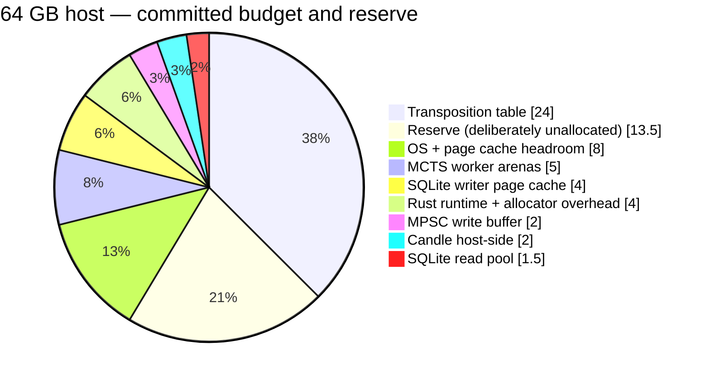

# Appendix A — Memory Budget at a Glance

Two budgets, two devices. They are never added together and never traded against each other: exceeding either one is fatal in its own way.

## Host RAM

```text
64 GB total
├── 24 GB  Transposition table                 (capacity_entries = 256M)
├──  8 GB  OS + page cache headroom            (policy)
├──  5 GB  MCTS worker arenas                  (10 x 512 MB)
├──  4 GB  SQLite writer page cache            (cache_size = -4194304)
├──  4 GB  Rust runtime + allocator overhead
├──  2 GB  MPSC write buffer                   (channel_capacity = 262144)
├──  2 GB  Candle host-side                    (staging + CPU fallback weights)
├── 1.5 GB SQLite read pool                    (6 x 256 MB)
└── 13.5 GB Reserve (deliberately unallocated)

Committed: 50.5 GB.  Validated at startup against limits.max_total_memory_gb = 56.

Not counted: the 8 GB mmap window -- virtual address space served by the
OS page cache, competing for the same physical pages as the 8 GB OS
reservation. It is not private process memory and must not be double-counted.
```



## VRAM — RTX 3050, 6 GB

```text
6.0 GB nameplate
├── ~1.0 GB  Desktop session / display output  (observed, NOT ours to spend)
└──  5.0 GB  Usable
     ├── 1.0 GB  Quantized weights             (Qwen2.5-1.5B-Instruct Q4_K_M)
     ├── 0.3 GB  KV cache                      (reset per request, bounded by max_tokens)
     ├── 0.5 GB  CUDA context + cuBLAS workspace
     ├── ---------
     ├── 1.8 GB  Face layer total               (against a 4.5 GB cap)
     └── 3.2 GB  Headroom

Validated at model load against limits.max_vram_mb = 4608.
Budget against 5.0 GB usable, never 6.0 GB nameplate -- §16.6 rule 1.
Nothing but the Face layer may allocate here -- §15.4.2.
```

The reserve on either device is not slack to be reclaimed later. On the host it absorbs page-cache growth, allocation spikes during index maintenance, and the fact that every figure above is an estimate; at 64 GB, ~21 % of the machine is the minimum defensible figure. On the card it absorbs the desktop session growing, another process claiming the device, and CUDA allocator fragmentation across a multi-day run. **A budget with no reserve is a budget that has already been exceeded.**

Full derivations: [§16.1](16-memory-strategy.md#161-memory-budget) and [§16.6](16-memory-strategy.md#166-vram-budget--new-in-14). What moved from 1.3, and why not proportionally, is [§16.1.1](16-memory-strategy.md#1611-what-moved-and-what-did-not-move-proportionally).

---

← [26. Summary](26-summary.md) · **[Index](README.md)** · [Appendix B — Performance Targets](appendix-b-performance-targets.md) →
